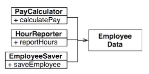
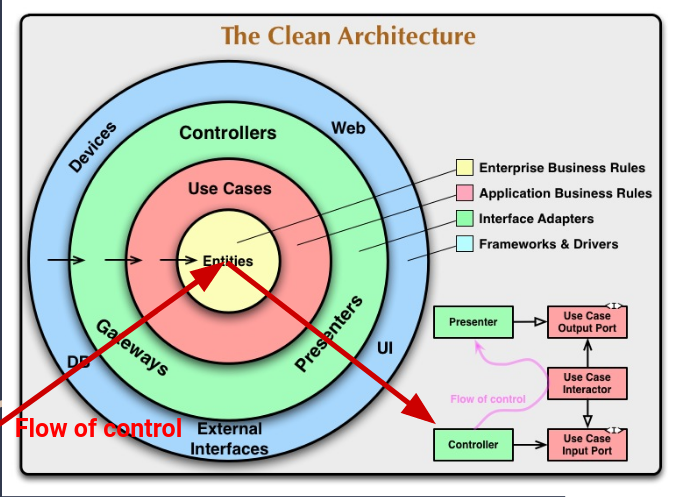
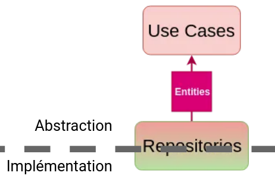
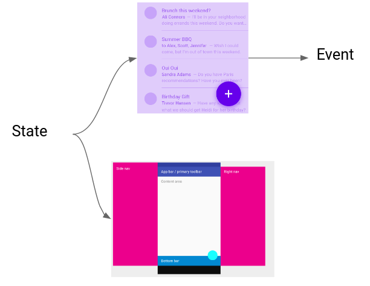

# Test-Driven Development et Clean Architecture

[TOC]

<div style="page-break-after: always; break-after: page;"></div>
## Un exo pour suivre

Prenez le template qu'on utilisera pour la formation :

```sh
git clone git@github.com:Darkness4/flutter-architecture-template.git
```

On cherchera à afficher les propriétés d'un utilisateur de Gitlab en particulier. Il faudra donc faire une requête HTTP GET à Gitlab.

Documentation : https://docs.gitlab.com/ee/api/users.html

Exemple avec [curl](https://curl.haxx.se/) (à taper dans le terminal) :

```sh
curl "https://gitlab.com/api/v4/users?username=Darkness4"
```

Exemple en dart : 

```dart
import 'package:http/http.dart' as http;

Future<void> printUser(String username) async {
  http.Response response = await http.get('https://gitlab.com/api/v4/users?username=$username');
  print(response.body);
}

Future<void> main() async {
  printUser("Darkness4");
}

```

<div style="page-break-after: always; break-after: page;"></div>
## Rappel sur un paradigme : Programmation Orientée Objet

La POO est basée sur **4 piliers**.

### Encapsulation

Un objet possède des propriétés et des méthodes, et possède différent niveau de restrictions.

En C, la restriction était posé avec le `.h`. Les objets définit dans le `.c` sont `protected` et les objets dans le `.h` sont publiques. Le **problème** en C, c'est que lorsque d'une structure est dans le `.h`, **tout le contenu** devient publique.

Du coup, en C++, pour arranger ce problème, on utilise des `class` qui définisse des propriétés et des méthodes accessibles uniquement selon 3 niveaux :

- **private** : Seule la classe a accès
- **protected** : Seules la classe et les sous-classes ont accès
- **public** : Accessible par tout le monde

Le`.h` existe toujours en C++ et permet de définir des classes privées, protégées ou publiques. Dans Java, on doit rajouter toujours `public class` ou `private class` (protected est le fichier java en lui-même). Dans Dart, publique c'est `class NomDeLaClasse`, protected c'est `class _NomDeLaClasse` et private, c'est une seule protected class dans un fichier .dart.

**NOTE** : 

```dart
class Person {
  int _age;

  int get age => _age;
  void set age(int age) => _age = age;
}
```

Ceci ne rajoute AUCUNE sécurité en plus.

Cependant, pour l'équivalence des données :

```dart
class Person {
  int _age;

  DateTime get birthday => calculateBirthday(_age);
  void set birthday(DateTime date) => DateTime.now().year - date.year;
}
```

<div style="page-break-after: always; break-after: page;"></div>
Ou juste un read-only :

```dart
class Person {
  int _age;

  DateTime get birthday => calculateBirthday(_age);
}
```

Ou mieux, une couche d'abstraction :

```dart
abstract class LivingBeing {
  DateTime get birthday;
}

class Person extends LivingBeing {
  int _age;

  @override
  DateTime get birthday => calculateBirthday(_age);
}
```

Le getter/setter devient intéressant quand on veut :

- éviter un doublons d'une propriété ayant la même signification
- du read-only
- du polymorphisme

<div style="page-break-after: always; break-after: page;"></div>
### Héritage

Il existe une nouvelle classe incluant les caractéristiques d'une autre classe.

C++ :

```cpp
class Forme {
 protected:
  std::string _name;
 public:
  Forme(std::string name) { _name = name; }
};
 
class Carre: public Forme {
 public:
  Carre(std::string name): Forme(name) {}
  void rename(std::string name) { _name = name; }
};
```

Dart :

```dart
class Forme {
  String _name;  // Protected in current file !

  Forme(String this._name);
}

class Carre extends Forme {
  Carre(String name): super(name);

  void rename(String name) => _name = name;
}
```

<div style="page-break-after: always; break-after: page;"></div>
### Abstraction

Un méthode abstraite est une fonction n'ayant aucune implémentation.

Une classe abstraite est un objet n'ayant pas encore une implémentation. Une classe abstraite ne peut être instanciée tant qu'il existe une méthode abstraite (virtual pure).

C++ :

```cpp
// Classe abstraite
class Forme {
 public:
  // Méthode virtuelle pure
  virtual float aire() = 0;

  // Une classe de base d’une hiérarchie polymorphe
  // doit toujours (ou presque) avoir un destructeur virtuel
  virtual ~Forme() {}
};
 
class Carre: public Forme {
 public:
  float aire() override { return m_cote*m_cote; }
 private:
  float m_cote;
};
 
class Cercle: public Forme {
 public:
  float aire() override { return 3.1415926535*m_rayon*m_rayon; }
 private:
  float m_rayon;
};
```

Dart : 

```dart
abstract class Forme {
  double get Aire;
}

class Carre extends Forme {
  double _cote;

  @override
  double get aire => _cote;
}
```

Une classe abstraite n'ayant que des méthodes abstraites est appelée **interface**.

Une classe héritant et implémentant une interface de telle sorte à ce qu'il peut être instancié est appelée **implémentation**.

<div style="page-break-after: always; break-after: page;"></div>
En C++, le respect de la définition ci-dessus indique une interface.

```cpp
class Interface
{
public:
    Interface(){}
    virtual ~Interface(){}
    virtual void method() = 0;
};
```

Java :

```java
interface Forme 
{ 
    int Aire(); 
} 

class Carre implements Forme {
    private float _cote;
    public int aire() { return _cote*_cote; }
}
```

En Dart, toute classe peut être implémentée :

```dart
abstract class Forme {
  double get Aire;
}

class Carre implements Forme {
  double _cote;

  @override
  double get aire => _cote;
}
```

<div style="page-break-after: always; break-after: page;"></div>
### Polymorphisme

Le polymorphisme définit le pouvoir d’exécuter la même fonction malgré que la signature de l'objet est différente.

C++ :

```c++
class Forme {
 public:
  virtual float aire() = 0;
  virtual ~Forme() {}
};
 
class Carre: public Forme {
 public:
  Carre(float cote): Forme() { m_cote = core; }
  float aire() override { return m_cote*m_cote; }
 private:
  float m_cote;
};
 
class Cercle: public Forme {
 public:
  Cercle(float rayon): Forme() { m_rayon = rayon; }
  float aire() override { return 3.1415926535*m_rayon*m_rayon; }
 private:
  float m_rayon;
};

int main() {
  Forme *forme;
  Carre carre(3);
  Cercle cercle(3);

  forme = &carre;
  forme->aire();
  forme = &cercle;
  forme->aire();
}
```

<div style="page-break-after: always; break-after: page;"></div>
Dart :

```dart
abstract class Forme {
  double get aire;
}

class Carre extends Forme {
  double _cote;

  Carre(this._cote);

  @override
  double get aire => _cote;
}

class Cercle extends Forme {
  double _rayon;

  Cercle(this._rayon);

  @override
  double get aire => 3.1415926535*_rayon*_rayon;
}

void main() {
  Forme forme;
  Cercle cercle = Cercle(3);
  Carre carre = Carre(3);

  forme = carre;
  print(forme.aire);
  forme = cercle;
  print(forme.aire);
} 
```

Avec le polymorphisme, il est possible de faire une **inversion de dépendances**, c'est-à-dire, le flux de contrôle est inversée par rapport aux dépendances.


<div style="page-break-after: always; break-after: page;"></div>
Sans inversion de dépendance :

```dart
// This is medium level.
class MediumLevel {
  void do() {}
}

// This is high level.
class HighLevel {
  final MediumLevel mediumLevel;

  HighLevel(this.mediumLevel);

  void doMl() => mediumLevel.do();
}

// Usage
void main {
  MediumLevel ml = MediumLevel();
  HighLevel(ml).doMl();
}
```

Avec inversion de dépendances :

```dart
// This is high level.
abstract class MediumLevel {
  void do();
}

class HighLevel {
  final MediumLevel mediumLevel;

  HighLevel(this.mediumLevel);

  void doMl() => mediumLevel.do();
}

// This is medium level. The dependency flow has inverted.
class MediumLevelImpl implements MediumLevel {
  @override
  void do() {}
}

// Usage
void main {
  MediumLevelImpl ml = MediumLevelImpl();
  HighLevel(ml);
}
```

Cela permet de découpler chaque classe et faciliter les tests unitaires en injectant des maquettes d'implémentations (e.g. `MockMediumLevel`).

<div style="page-break-after: always; break-after: page;"></div>
### Conclusion

La programmation orientée objet permet un contrôle sur le flux de dépendance sur tout le code. Clean Architecture va pouvoir permettre de créer des couches d'abstraction afin que le flux de dépendances reste le même sur tout le code.

<div style="page-break-after: always; break-after: page;"></div>
## Les 5 principes S.O.L.I.D.

Clean Architecture se base sur ces 5 principes qui permet de créer une base de code stable.

### Single Responsibility Principle

**“A module or a class should be responsible to one, and only one, actor”**

**“A module should have one, and only one, reason to change”**- Martin, Robert C. (2003). Agile Software Development, Principles, Patterns, and Practices

En gros, un objet ne doit pas changer à cause de plusieurs acteurs.


```dart
// Mauvais
class Employee {
  double workingHours;
  double salary;

  double calculatePay();  // Pour CFO
  void reportHour();  // Pour COO
  void save();  // Pour CTO
}
```

Ici, `Employee` peut changer (en terme de code source) à cause de plusieurs raisons. Rxemple : le CFO, COO et CTO peut faire changer l'objet selon leur usecase : `calculatePay` peut devenir `calculatePayInDollar` et va changer `salary` selon sont usecase.

Un autre exemple serait que le CFO utilise maintenant `reportHour` et le trafique sans que le COO le sache.

Cela arrive très couramment quand le code est partagé.

C'est pourquoi la seule et unique raison de changer une classe serait **l'ajout ou la déprécation d'une fonctionnalité**. 

<div style="page-break-after: always; break-after: page;"></div>
Pour respecter le SRP, il faut donc une classe par responsabilité :



```dart
class PayCalculator {
  void calculatePay(Employee employee);
}
```

Les changements attribués à PayCalculator devrait **éviter de provoquer des effets secondaires.**

<div style="page-break-after: always; break-after: page;"></div>
### Open-Closed Principle

Une classe est ouverte à l'extension et fermé à la modification.

Ceci rentre parfaitement dans la définition d'une classe abstraite.

```dart
abstract class Forme {
  // Fermé à la modification
  double get aire;
}

class Carre extends Forme {
  double _cote;

  Carre(this._cote);

  // Ouverte à l'extension
  @override
  double get aire => _cote;
}

class Cercle extends Forme {
  double _rayon;

  Cercle(this._rayon);

  // Ouverte à l'extension
  @override
  double get aire => 3.1415926535*_rayon*_rayon;
}

void main() {
  Forme forme;
  Cercle cercle = Cercle(3);
  Carre carre = Carre(3);

  forme = carre;
  print(forme.aire);
  forme = cercle;
  print(forme.aire);
} 
```

Si la classe n'était pas fermé à la modification (c.-à-d. `aire` devient `newAire`), le polymorphisme ne fonctionnerais plus.

<div style="page-break-after: always; break-after: page;"></div>
### Liskov Substitution Principle

Si un objet o1 de type S, un sous-type de T.

Alors, pour tout programme P utilisant T, o1 peut être remplacé par o2 de type S **sans pour autant changer le comportement de P**.


C'est similaire au polymorphisme, sauf que l'on **prend en compte le comportement du programme**.

Une violation serait de ce type :


Ici, RubberDuck hérite de Duck. Cependant, il modifie le comportement de P en faisant crasher le programme P quand RubberDuck n'a pas de batterie. Ceci est une claire violation du LSP, car il l'implémentation provque une **effet secondaire non géré**.

<div style="page-break-after: always; break-after: page;"></div>
### Interface Segregation Principle

Aucun client ne devrait dépendre sur des fonctions qu'ils n'utilisent pas.


Solution :


(U1Ops serait l'équivalent du téléphone, U2Ops = talkie-walkie, U3Ops = sirène)

En mettant en place des interface, on évite de se coller des fonctions qui n'ont aucun rapport par rapport à l'utilisateur.

<div style="page-break-after: always; break-after: page;"></div>
### Dependency Inversion Principle

- Les modules de haut niveau ne doivent pas dépendre des modules de bas niveau. Les deux devraient dépendre d'abstractions.
- Les abstractions ne doivent pas dépendre de détails. Les détails (implémentations concrètes) doivent dépendre des abstractions.


Si on observe bien, les flèches contrôle de flux sont inversé par rapport au dépendances (ServiceImpl dépend de Service, mais Service contrôle ServiceImpl).

Haut-niveau :

```dart
class App {
  final Service service;

  App(this.service);

  void useService() => service.use();
}

abstract class Service {
  void use();
}

// Injecteur de dépendances. Permet d'utiliser des singletons.
abstract class ServiceFactory {
  Service makeSvc();
}
```

<div style="page-break-after: always; break-after: page;"></div>
Bas-niveau :

```dart
class ServiceImpl implements Service {
  @override
  void use() => print("Hello World !");
}

class ServiceFactoryImpl implements ServiceFactory {
  static final Service _singletonService = ServiceImpl();

  @override
  Service makeSvc() => _singletonService;
}
```

```dart
void main() {
  ServiceFactory serviceFactory = ServiceFactoryImpl(); // Only once
  Service service = serviceFactory.makeSvc();
  App app = App(service);
  app.useService();
}
```

En utilisant les fonctionnalités Dart :

```dart
class App {
  final Service service;

  App(this.service);

  void useService() => service.use();
}

abstract class Service {
  void use();
}

class ServiceImpl implements Service {
  static final Service _singletonService = ServiceImpl._internal();

  ServiceImpl._internal();

  factory ServiceImpl.makeSvc() => _singletonService;

  @override
  void use() => print("Hello World !");
}

void main() {
  Service service = ServiceImpl.makeSvc(); // Only once
  App app = App(service);
  app.useService();
}

```

A la place d'un factory, on utilisera un container de dépendances qui fera de l'injection de dépendances. On pourra faire des facotry, singletons et lazySingletons.

<div style="page-break-after: always; break-after: page;"></div>
## Clean Architecture par Uncle Bob (Robert C. Martin)

### En gros


Voir : https://blog.cleancoder.com/uncle-bob/2012/08/13/the-clean-architecture.html

**The Dependency Rule**

Circles = areas of software.

Further in you go, the higher level the software becomes. 

outer = mechanisms. inner = policies.

*Source code dependencies* can only point *inwards*.

Everything in an inner circle cannot know at all about something in an outer circle.

**Entities**

Entities encapsulate *Enterprise wide* business rules.

An entity can be an object with methods, or it can be a set of data structures and functions. 

<div style="page-break-after: always; break-after: page;"></div>
**Use Cases**

These use cases orchestrate the flow of data to and from the entities, and direct those entities to use their *enterprise wide* business rules to achieve the goals of the use case.

X changes in this layer to affect the entities. X expect this layer to be affected by changes to externalities such as the DB, the UI, or any of the common frameworks.

This layer is isolated from such concerns.

Expect that changes to the operation of the application *will* affect the use-cases. If the details of a use-case change, then some code in this layer will certainly be affected.

**Interface Adapters**

Convert data from the format most convenient for the use cases and entities, to the format most convenient for some external agency such as the DB or the Web. 

**Frameworks and Drivers.**

The outermost layer is generally composed of frameworks and tools such as the DB, the Web Framework, etc.

Generally you don’t write much code in this layer other than glue code that communicates to the next circle inwards.

<div style="page-break-after: always; break-after: page;"></div>
### Clean Architecture for Flutter




A chaque fois, que le flux de contrôle est inversée par rapport au dépendance, il faudra rajouter une couche d'abstraction. On compte 2 endroits où le flux est inversé : DataSource et Repositories.

<div style="page-break-after: always; break-after: page;"></div>
## Clean Architecture par Matej Rešetár

<iframe width="560" height="315" src="https://www.youtube.com/embed/KjE2IDphA_U" frameborder="0" allow="accelerometer; autoplay; encrypted-media; gyroscope; picture-in-picture" allowfullscreen></iframe>

### Couche Data

#### Data Sources

##### Rôle


Dans Clean Architecture, les data sources permettent de **récupérer des données** des stockages persistants.

Elles sont responsables des appels API tel que CRUD et le management du stockage local.

##### Type de data source

Une data source peut être locale ou remote.

Les solutions locales sur téléphone Android sont généralement :

- une base de données local ([SQLite](https://www.sqlite.org/index.html), [Hive](https://github.com/hivedb/hive), ...)
- [SharedPreferences](https://developer.android.com/reference/android/content/SharedPreferences)
- [KeyStore](https://developer.android.com/training/articles/keystore)
- Un fichier local

Les solutions remote sur téléphone Android sont généralement :

- Un API
- Un SDK (cloud firestore)

On rappelle qu'un API (Application Programming Interface) est une interface ou un protocole qui permet le lien entre un serveur et un client.

Exemple d'API : 

- RESTful API (le plus connu)
- GraphQL
- Falcor API
- gRPC API
- Pure JSON API (do it yourself)

Le protocole d'un API pour DB est généralement **HTTP**.

Une base de données suit généralement les 4 fonctions basiques CRUD : Create, Read, Update, Delete.

Voici les méthode HTTP généralement utilisé :

|       HTTP METHODS        | Member resource, such as `https://api.example.com/collection/item3` |
| :-----------------------: | :----------------------------------------------------------: |
|      GET<br />(Read)      | *Retrieve* representation of the member resource in the response body. |
|    POST<br />(Create)     | *Create* a member resource in the member resource using the instructions in the request body. The URI of the created member resource is *automatically assigned* and returned in the response *Location* header field. |
| PUT<br />(Update/Replace) | *Replace* all the representations of the member resource or *create* the member resource if it does not exist, with the representation in the request body. |
|    PATCH<br />(Update)    | *Update* all the representations of the member resource, or *may create* the member resource if it does not exist, using the instructions in the request body. |
|   DELETE<br />(Deletec)   |   *Delete* all the representations of the member resource.   |

|      Operation       |                         SQL                          |                             HTTP                             | [RESTful WS](https://en.wikipedia.org/wiki/Representational_state_transfer#Applied_to_Web_services) |     DDS     |
| :------------------: | :--------------------------------------------------: | :----------------------------------------------------------: | :----------------------------------------------------------: | :---------: |
|      **C**reate      | [INSERT](https://en.wikipedia.org/wiki/Insert_(SQL)) | [PUT](https://en.wikipedia.org/wiki/PUT_(HTTP)) / [POST](https://en.wikipedia.org/wiki/POST_(HTTP)) |      [POST](https://en.wikipedia.org/wiki/POST_(HTTP))       |    write    |
| **R**ead (Retrieve)  | [SELECT](https://en.wikipedia.org/wiki/Select_(SQL)) |       [GET](https://en.wikipedia.org/wiki/GET_(HTTP))        |       [GET](https://en.wikipedia.org/wiki/GET_(HTTP))        | read / take |
| **U**pdate (Modify)  | [UPDATE](https://en.wikipedia.org/wiki/Update_(SQL)) | [PUT](https://en.wikipedia.org/wiki/PUT_(HTTP)) / [POST](https://en.wikipedia.org/wiki/POST_(HTTP)) / [PATCH](https://en.wikipedia.org/wiki/PATCH_(HTTP)) |       [PUT](https://en.wikipedia.org/wiki/PUT_(HTTP))        |    write    |
| **D**elete (Destroy) | [DELETE](https://en.wikipedia.org/wiki/Delete_(SQL)) |    [DELETE](https://en.wikipedia.org/wiki/DELETE_(HTTP))     |    [DELETE](https://en.wikipedia.org/wiki/DELETE_(HTTP))     |   dispose   |

<div style="page-break-after: always; break-after: page;"></div>
##### Code

En suivant le template données en début du document, le template doit afficher les données d'un utilisateur Github.

###### Remote

```dart
abstract class GithubRemoteDataSource {
  Future<GithubUserModel> fetchUser(String username);
}

class GithubRemoteDataSourceImpl implements GithubRemoteDataSource {
  final http.Client client;

  GithubRemoteDataSourceImpl({@required this.client});

  @override
  Future<GithubUserModel> fetchUser(String username) async {
    final response = await client.get('https://api.github.com/users/$username');

    if (response.statusCode == 200) {
      return GithubUserModel.fromJson(  // Parse
          json.decode(response.body) as Map<String, dynamic>);
    } else {
      throw ServerException('Failed to load User : ${response.statusCode}');
    }
  }
}
```

<div style="page-break-after: always; break-after: page;"></div>
###### Local

```dart
abstract class GithubLocalDataSource {
  Future<void> cacheUser(GithubUserModel userToCache, String username);

  Future<GithubUserModel> fetchCachedUser(String username);
}

class GithubLocalDataSourceImpl implements GithubLocalDataSource {
  final Box<dynamic> box;  // This is a Hive Local DB

  GithubLocalDataSourceImpl({@required this.box});

  @override
  Future<void> cacheUser(GithubUserModel userToCache, String username) {
    return box.put(  // Create or Replace {key: value}
      username,
      json.encode(userToCache.toJson()),
    );
  }

  @override
  Future<GithubUserModel> fetchCachedUser(String username) async {
    final jsonString = box.get(username) as String;  // Read
    if (jsonString != null) {
      return GithubUserModel.fromJson(  // Parse
          json.decode(jsonString) as Map<String, dynamic>);
    } else {
      throw CacheException();
    }
  }
}
```

<div style="page-break-after: always; break-after: page;"></div>
##### Tests unitaires

###### Remote

```dart
class MockHttpClient extends Mock implements http.Client {}

void main() {
  GithubRemoteDataSourceImpl dataSource;
  MockHttpClient mockHttpClient;
  const String tRepo = 'Darkness4/minitel-app';
  const String tUser = 'Darkness4';

  setUp(() {
    mockHttpClient = MockHttpClient();
    dataSource = GithubRemoteDataSourceImpl(client: mockHttpClient);
  });

  void setUpMockHttpClientSuccess200() {
    when(mockHttpClient.get(
      argThat(startsWith('https://api.github.com/users/')),
    )).thenAnswer((_) async => http.Response(fixture('user.json'), 200));
  }

  void setUpMockHttpClientFailure404() {
    when(mockHttpClient.get(any))
        .thenAnswer((_) async => http.Response('Something went wrong', 404));
  }

  group('fetchUser', () {
    final tGithubUserModel = GithubUserModel.fromJson(
        json.decode(fixture('user.json')) as Map<String, dynamic>);

    test(
      "should perform a GET request on a URL with tUser being the endpoint",
      () async {
        // arrange
        setUpMockHttpClientSuccess200();
        // act
        await dataSource.fetchUser(tUser);
        // assert
        verify(mockHttpClient.get(
          'https://api.github.com/users/$tUser',
        ));
      },
    );

    test(
      'should return GithubUserModel when the response code is 200 (success)',
      () async {
        // arrange
        setUpMockHttpClientSuccess200();
        // act
        final result = await dataSource.fetchUser(tUser);
        // assert
        expect(result, equals(tGithubUserModel));
      },
    );

    test(
      'should throw a ServerException when the response code is 404 or other',
      () async {
        // arrange
        setUpMockHttpClientFailure404();
        // act
        final call = dataSource.fetchUser;
        // assert
        expect(
            () => call(tUser), throwsA(const TypeMatcher<ServerException>()));
      },
    );
  });
}
```

<div style="page-break-after: always; break-after: page;"></div>
###### Local

```dart
class _MockBox extends Mock implements Box<dynamic> {}

void main() {
  GithubLocalDataSourceImpl dataSource;
  MockBox mockBox;
  const String tRepo = 'Darkness4/minitel-app';
  const String tUsername = 'Darkness4';

  setUp(() {
    mockBox = MockBox();
    dataSource = GithubLocalDataSourceImpl(
      box: mockBox,
    );
  });

  group('fetchCachedUser', () {
    final tGithubUserModel = GithubUserModel.fromJson(
        json.decode(fixture('user.json')) as Map<String, dynamic>);
    test(
      'should return GithubUserModel from SharedPreferences when there is one in the cache',
      () async {
        // arrange
        when<dynamic>(mockBox.get(any)).thenReturn(fixture('user.json'));
        // act
        final result = await dataSource.fetchCachedUser(tUsername);
        // assert
        verify<dynamic>(mockBox.get(tUsername));
        expect(result, equals(tGithubUserModel));
      },
    );

    test(
      'should throw a CacheExeption when there is not a cached value',
      () async {
        // arrange
        when<dynamic>(mockBox.get(any)).thenReturn(null);
        // act
        final call = dataSource.fetchCachedUser;
        // assert
        expect(() => call(tRepo), throwsA(const TypeMatcher<CacheException>()));
      },
    );
  });

  group('cacheUser', () {
    final tGithubUserModel = GithubUserModel.fromJson(
        json.decode(fixture('user.json')) as Map<String, dynamic>);

    test(
      'should call SharedPreferences to cache the data',
      () async {
        // act
        await dataSource.cacheUser(tGithubUserModel, tUsername);
        // assert
        final expectedJsonString = json.encode(tGithubUserModel.toJson());
        verify(mockBox.put(
          tUsername,
          expectedJsonString,
        ));
      },
    );
  });
}
```

<div style="page-break-after: always; break-after: page;"></div>
#### Models

##### Rôle


Les models sont les objets dans la couche Data. Elles permettent de décoder et convertir les données récupérées d'une Data Source (`fromJson`).

Elles peuvent également exporter leur données sous le format de l'API (`toJson`).

Si une data source est inexistante, un model ne devrait pas exister.

Un model est une extension d'un entity (c'est-à-dire qu'elle possède les même données).

**Un model doit donc assurer le transfert aisé vers une Data Source ou vice-versa.**

<div style="page-break-after: always; break-after: page;"></div>
##### Code

On utilise, ici, `JsonSerializable` pour pouvoir générer automatique toJson et fromJson.

On utilise également `Equatable` qui permet de comparer différentes classes en terme de données et non en terme de HashCode (signature de l'instance).

```dart
part 'user_model.g.dart';

@JsonSerializable(explicitToJson: true)
class GithubUserModel extends Equatable {
  // Propriétés
  final String login;
  final int id;
  // [...]
  final DateTime updated_at;

  // Constructeur immutable
  const GithubUserModel({
    this.login,
    this.id,
    // [...]
    this.updated_at,
  });

  @override
  List<Object> get props => <Object>[
        login,
        id,
        // [...]
        updated_at,
      ];

  // Méthode de conversion : export
  Map<String, dynamic> toJson() => _$GithubUserModelToJson(this);

  // Méthode de conversion : import
  factory GithubUserModel.fromJson(Map<String, dynamic> json) =>
      _$GithubUserModelFromJson(json);
}
```

<div style="page-break-after: always; break-after: page;"></div>
**Code généré :**

```dart
// GENERATED CODE - DO NOT MODIFY BY HAND

part of 'user_model.dart';

// **************************************************************************
// JsonSerializableGenerator
// **************************************************************************

GithubUserModel _$GithubUserModelFromJson(Map<String, dynamic> json) {
  return GithubUserModel(
    login: json['login'] as String,
    id: json['id'] as int,
    // [...]
    updated_at: json['updated_at'] == null
        ? null
        : DateTime.parse(json['updated_at'] as String),
  );
}

Map<String, dynamic> _$GithubUserModelToJson(GithubUserModel instance) =>
    <String, dynamic>{
      'login': instance.login,
      'id': instance.id,
      // [...]
      'updated_at': instance.updated_at?.toIso8601String(),
    };
```

<div style="page-break-after: always; break-after: page;"></div>
#### Repositories Implementations

##### Rôle


L'utilisation de repositories est aussi connu sous le nom de Repository Pattern. 

Il faut savoir qu'il avant tout faire la couche l'abstraction **en premier** qui est dans la couche **Domain**.

Un repository doit contenir les méthode CRUD (ou plus) dédié à une **unique entity/business object**. Le repository de la couche Data **doit** implémenter un repository de la couche **Domain**.

Dans l'implémentation, il s'agira de **trier** entre Local et Remote Data Source.

##### Code

```dart
class UserRepositoryImpl implements UserRepository {
  final GithubLocalDataSource localDataSource;
  final GithubRemoteDataSource remoteDataSource;
  final NetworkInfo networkInfo;
  final GithubUserMapper mapper;

  const UserRepositoryImpl({
    @required this.remoteDataSource,
    @required this.localDataSource,
    @required this.networkInfo,
    @required this.mapper,
  });

  @override
  Future<GithubUser> getUser(String username) => _getUser(username);

  Future<GithubUser> _getUser(String username) async {
    if (await networkInfo.result != ConnectivityResult.none) {
      final user = await remoteDataSource.fetchUser(username);
      await localDataSource.cacheUser(user, username);
      return mapper.mapTo(user);
    } else {
      final user = await localDataSource.fetchCachedUser(username);
      return mapper.mapTo(user);
    }
  }
}

```

<div style="page-break-after: always; break-after: page;"></div>
##### Tests unitaires

```dart
class MockRemoteDataSource extends Mock implements GithubRemoteDataSource {}

class MockGithubUserMapper extends Mock implements GithubUserMapper {}

class MockLocalDataSource extends Mock implements GithubLocalDataSource {}

class MockNetworkInfo extends Mock implements NetworkInfo {}

void main() {
  UserRepositoryImpl repository;
  MockRemoteDataSource mockRemoteDataSource;
  MockGithubUserMapper mockGithubUserMapper;
  MockNetworkInfo mockNetworkInfo;
  MockLocalDataSource mockLocalDataSource;

  setUp(() {
    mockRemoteDataSource = MockRemoteDataSource();
    mockGithubUserMapper = MockGithubUserMapper();
    mockLocalDataSource = MockLocalDataSource();
    mockNetworkInfo = MockNetworkInfo();
    repository = UserRepositoryImpl(
      remoteDataSource: mockRemoteDataSource,
      localDataSource: mockLocalDataSource,
      networkInfo: mockNetworkInfo,
      mapper: mockGithubUserMapper,
    );
  });

  void runTestsOnline(Function body) {
    group('device is online', () {
      setUp(() {
        when(mockNetworkInfo.result)
            .thenAnswer((_) async => ConnectivityResult.wifi);
      });

      body();
    });
  }

  void runTestsOffline(Function body) {
    group('device is offline', () {
      setUp(() {
        when(mockNetworkInfo.result)
            .thenAnswer((_) async => ConnectivityResult.none);
      });

      body();
    });
  }

  group('getUser', () {
    const tUser = 'Darkness4';
    final DateTime tDateTime = DateTime.parse("1970-01-01T00:00:00Z");
    final tGithubUserModel = GithubUserModel.fromJson(
        json.decode(fixture('user.json')) as Map<String, dynamic>);
    final tGithubUser = GithubUser(
      login: 'login',
      id: 0,
      // [...]
      updated_at: tDateTime,
    );

    test(
      'should check if the device is online',
      () async {
        // arrange
        when(mockNetworkInfo.result)
            .thenAnswer((_) async => ConnectivityResult.wifi);
        when(mockRemoteDataSource.fetchUser(any)).thenAnswer((_) async => null);
        when(mockGithubUserMapper.mapTo(any)).thenReturn(null);
        // act
        await repository.getUser(tUser);
        // assert
        verify(mockNetworkInfo.result);
      },
    );

    runTestsOnline(() {
      test(
        'should return remote data when the call to remote data source is successful',
        () async {
          // arrange
          when(mockRemoteDataSource.fetchUser(any))
              .thenAnswer((_) async => tGithubUserModel);
          when(mockGithubUserMapper.mapTo(tGithubUserModel))
              .thenReturn(tGithubUser);
          // act
          final result = await repository.getUser(tUser);
          // assert
          verify(mockRemoteDataSource.fetchUser(tUser));
          expect(result, equals(tGithubUser));
        },
      );

      test(
        'should cache the data locally when the call to remote data source is successful',
        () async {
          // arrange
          when(mockRemoteDataSource.fetchUser(any))
              .thenAnswer((_) async => tGithubUserModel);
          // act
          await repository.getUser(tUser);
          // assert
          verify(mockRemoteDataSource.fetchUser(tUser));
          verify(mockLocalDataSource.cacheUser(tGithubUserModel, tUser));
        },
      );

      test(
        'should return server failure when the call to remote data source is unsuccessful',
        () async {
          // arrange
          when(mockRemoteDataSource.fetchUser(any))
              .thenThrow(ServerException());
          // act
          final call = repository.getUser;
          try {
            await call(tUser);
            fail("exception not thrown");
          } catch (e) {
            expect(e, isInstanceOf<ServerException>());
          }
        },
      );
    });

    runTestsOffline(() {
      test(
        'should return last locally cached data when the cached data is present',
        () async {
          // arrange
          when(mockLocalDataSource.fetchCachedUser(tUser))
              .thenAnswer((_) async => tGithubUserModel);
          when(mockGithubUserMapper.mapTo(tGithubUserModel))
              .thenReturn(tGithubUser);
          // act
          final result = await repository.getUser(tUser);
          // assert
          verifyZeroInteractions(mockRemoteDataSource);
          verify(mockLocalDataSource.fetchCachedUser(tUser));
          expect(result, equals(tGithubUser));
        },
      );

      test(
        'should return CacheFailure when there is no cached data present',
        () async {
          // arrange
          when(mockLocalDataSource.fetchCachedUser(tUser))
              .thenThrow(CacheException());
          // act
          final call = repository.getUser;
          // assert
          try {
            await call(tUser);
            fail("exception not thrown");
          } catch (e) {
            expect(e, isInstanceOf<CacheException>());
          }
        },
      );
    });
  });
}
```

<div style="page-break-after: always; break-after: page;"></div>
#### Mappers

##### Rôle


Un mapper doit faire passer les données de model vers entity et vice-versa. Il s'agit d'une solution purement fonctionnelle et peut également être résolu par héritage.

##### Code

Core

```dart
abstract class Mapper<I, O> {
  const Mapper();

  O mapFrom(I entity);

  I mapTo(O model);
}
```

<div style="page-break-after: always; break-after: page;"></div>
Mapper

```dart

class GithubUserMapper implements Mapper<GithubUser, GithubUserModel> {
  const GithubUserMapper();

  @override
  GithubUserModel mapFrom(GithubUser entity) {
    return GithubUserModel(
      login: entity.login,
      id: entity.id,
      // [...]
      updated_at: entity.updated_at,
    );
  }

  @override
  GithubUser mapTo(GithubUserModel model) {
    return GithubUser(
      login: model.login,
      id: model.id,
      // [...]
      updated_at: model.updated_at,
    );
  }
}
```

<div style="page-break-after: always; break-after: page;"></div>
##### Test unitaires

```dart
void main() {
  GithubUserMapper mapper;

  setUp(() {
    mapper = GithubUserMapper();
  });

  final DateTime tDateTime = DateTime.parse("1970-01-01T00:00:00Z");
  final tGithubUserModel = GithubUserModel(
    login: 'login',
    // [...]
    updated_at: tDateTime,
  );
  final tGithubUser = GithubUser(
    login: 'login',
    id: 0,
    // [...]
    updated_at: tDateTime,
  );

  test(
    'mapFrom',
    () async {
      // act
      final result = await mapper.mapFrom(tGithubUser);
      // assert
      expect(result, equals(tGithubUserModel));
    },
  );

  test(
    'mapTo',
    () async {
      // act
      final result = await mapper.mapTo(tGithubUserModel);
      // assert
      expect(result, equals(tGithubUser));
    },
  );
}
```

#### Conclusion

Ce qu'il faut retenir c'est que :

- Les **data sources** prennent les données et deviennent des **model**s
- Les **repositories** utilise un seul **model** issu des **data sources** et fait le passage du **model vers entity** avec un **mapper**

<div style="page-break-after: always; break-after: page;"></div>
### Couche Domain

#### Description



Le demain est aussi connu sous le nom de **business logic holder**, c'est-à-dire, il contient le code métier permettant la réussite d'un cas d'utilisation.

La couche domain contient 3  types d'objets :

- Le *repository* (abstraite)
- Les *entities*
- Les *use cases*

#### Repositories

##### Rôle


L'utilisation de repositories est aussi connu sous le nom de **Repository Pattern**. Un repository contient un unique entity / business object et contient les méthodes CRUD.

Un repository est aussi connu comme étant une **Database Context**, car il contient un entity root et ses agrégats.

Dans la couche domain, les **repositories** sont **abtraites**.

##### Code

```dart
abstract class UserRepository {
  Future<GithubUser> getUser(String username);
}
```

<div style="page-break-after: always; break-after: page;"></div>
#### Entities

##### Rôle


Un entities contient des données et les méthodes métiers propres à celui-ci. (**Attention à bien respecter le Single Responsibility Principle**).

Un entities ne dépend pas obligatoirement d'un model s'il n'y a pas de data sources disponible.

##### Code

```dart
class GithubUser extends Equatable {
  final String login;
  final int id;
  // [...]
  final DateTime updated_at;

  const GithubUser({
    this.login,
    this.id,
    // [...]
    this.updated_at,
  });

  @override
  List<Object> get props => <Object>[
        login,
        id,
        // [...]
        updated_at,
      ];
}

```

Ici, `Equatable` joue un rôle clé pour la comparaison de données.

##### Tests unitaires

Vide, mais ce n'est pas parce qu'il n'y aucun test qu'il ne faut pas en faire.

Il faut faire un test à chaque nouvelle fonction.

<div style="page-break-after: always; break-after: page;"></div>
#### Use Cases

##### Rôle


Un use case contient le code métier nécessaire à l'accomplissement d'un use case.

##### Code

Core

```dart
abstract class Usecase<Type, Params> {
  const Usecase();

  Type call(Params params);
}

class NoParams extends Equatable {
  const NoParams();

  @override
  List<Object> get props => [];
}
```

On utilise une fonctionnalité spécifique à Dart. Il est possible d'appeler une fonction propre à la classe sans explicitement l'appeler. Exemple : `Usecase(params) == Usecase.call(params)`.

Use case

```dart
class GetGithubUser extends Usecase<Future<GithubUser>, String> {
  final UserRepository repository;

  const GetGithubUser(this.repository);

  @override
  Future<GithubUser> call(String user) {
    // No error handling, error will be displayed through BLoC
    return repository.getUser(user);
  }
}
```

<div style="page-break-after: always; break-after: page;"></div>
##### Test unitaires

```dart
class MockUserRepository extends Mock implements UserRepository {}

void main() {
  GetGithubUser usecase;
  MockUserRepository mockUserRepository;

  setUp(() {
    mockUserRepository = MockUserRepository();
    usecase = GetGithubUser(mockUserRepository);
  });

  const tUser = 'Darkness4';
  final DateTime tDateTime = DateTime.parse("1970-01-01T00:00:00.000Z");
  final tGithubUser = GithubUser(
    login: 'login',
    id: 0,
    // [...]
    updated_at: tDateTime,
  );

  test(
    'should get user from the repository',
    () async {
      // arrange
      when(mockUserRepository.getUser(any))
          .thenAnswer((_) async => tGithubUser);
      // act
      final result = await usecase(tUser);
      // assert
      expect(result, tGithubUser);
      verify(mockUserRepository.getUser(tUser));
      verifyNoMoreInteractions(mockUserRepository);
    },
  );
}
```

#### Conclusion

La couche **domain** répond aux **use cases**.

On récupère des **entities** grâce aux **repositories**. Ces entities sont utilisés dans des **use cases**.

<div style="page-break-after: always; break-after: page;"></div>
#### Pratique

##### 1. Model et Entity

On cherche à afficher les propriétés d'un utilisateur de Gitlab en particulier. Il faudra donc faire une requête HTTP GET à Gitlab.

Documentation : https://docs.gitlab.com/ee/api/users.html

Exemple avec [curl](https://curl.haxx.se/) (à taper dans le terminal) :

```sh
curl "https://gitlab.com/api/v4/users?username=Darkness4"
```

Exemple en dart : 

```dart
import 'package:http/http.dart' as http;

Future<void> printUser(String username) async {
  http.Response response = await http.get('https://gitlab.com/api/v4/users?username=$username');
  print(response.body);
}

Future<void> main() async {
  printUser("Darkness4");
}
```

Essayez donc de :

- Implémenter un model GitlabUserModel
- Implémenter un entity GitlabUser
- Implémenter le mapper GitlabUserMapper

On utilisera bien évidemment `Equatable` et `json_serializable`.

<div style="page-break-after: always; break-after: page;"></div>
**Pour implémenter un model :**

```dart
part 'user_model.g.dart';

@JsonSerializable(explicitToJson: true)
class GitlabUserModel extends Equatable {
  final int id;
  final String name;
  final String username;
  final String state;
  final String avatar_url;
  final String web_url;

  const GitlabUserModel({
    this.id,
    this.username,
    this.state,
    this.avatar_url,
    this.web_url,
  });

  factory GitlabUserModel.fromJson(Map<String, dynamic> json) =>
      _$GitlabUserModelFromJson(json);

  @override
  List<Object> get props => <Object>[
        this.id,
        this.username,
        this.state,
        this.avatar_url,
        this.web_url,
      ];

  Map<String, dynamic> toJson() => _$GitlabUserModelToJson(this);
}
```

Ensuite, lancer le générateur de code dans un terminal :

```sh
flutter pub run build_runner build
```

Le tutoriel de `json_serializable` : https://flutter.dev/docs/development/data-and-backend/json#serializing-json-using-code-generation-libraries

<div style="page-break-after: always; break-after: page;"></div>
**Pour implémenter un entity**

```dart
class GitlabUser extends Equatable {
  final int id;
  final String name;
  final String username;
  final String state;
  final String avatar_url;
  final String web_url;

  const GitlabUser({
    this.id,
    this.username,
    this.state,
    this.avatar_url,
    this.web_url,
  });
}
```

**Pour implémenter un mapper**

```dart
class GitlabUserMapper implements Mapper<GitlabUser, GitlabUserModel> {
  const GitlabUserMapper();

  @override
  GitlabUserModel mapFrom(GitlabUser entity) {
    return GitlabUserModel(
      id: entity.id,
      name: entity.name,
      username: entity.username,
      state: entity.state,
      avatar_url: entity.avatar_url,
      web_url: entity.web_url,
    );
  }

  @override
  GitlabUser mapTo(GitlabUserModel model) {
    return GitlabUser(
      id: model.id,
      name: model.name,
      username: model.username,
      state: model.state,
      avatar_url: model.avatar_url,
      web_url: model.web_url,
    );
  }
}
```

<div style="page-break-after: always; break-after: page;"></div>
##### 2. RemoteDataSource

Il faut donc implémenter le récupérateur de données. Faisons tout d'abord la couche d'abstraction vu que nous savons ce que nous devons faire :

```dart
abstract class GitlabRemoteDataSource {
  Future<GitlabUserModel> getUser(String username);
}
```

Ensuite, il s'agira de faire une requêtte HTTP `GET https://gitlab.com/api/v4/users?username=:username`. Faisons donc l'implémentation :

```dart
import 'package:http/http.dart' as http;

class GitlabRemoteDataSourceImpl implements GitlabRemoteDataSource {
  final http.Client client;

  GithubRemoteDataSourceImpl({@required this.client});

  @override
  Future<GitlabUserModel> fetchUser(String username) async {
    final response = await client.get('https://gitlab.com/api/v4/users?username=$username');

    if (response.statusCode == 200) {
      return GitlabUserModel.fromJson(
          json.decode(response.body) as Map<String, dynamic>);
    } else {
      throw ServerException('Failed to load User : ${response.statusCode}');
    }
  }
}

```

`ServerException` est une classe qui hérite de `Exception` et permet de réagir spécifiquement aux erreurs réseau. Elle est implémenter dans le template dans `lib/core/error/exceptions.dart`.

```dart
class ServerException implements Exception {
  final dynamic message;

  ServerException([this.message]);

  @override
  String toString() {
    if (message == null) return "ServerException";
    return "ServerException: $message";
  }
}
```

<div style="page-break-after: always; break-after: page;"></div>
##### 3. Repository

Vu que l'on a qu'un data source, c'est très rapide :

Côté **Domain**, l'abstraction :

```dart
abstract class GitlabUserRepository {
  Future<GitlabUser> getUser(String username);
}
```

Côté **Data**, l'implémentation :

```dart
class GitlabUserRepositoryImpl implements GitlabUserRepository {
  final GitlabRemoteDataSource remoteDataSource;
  final GitlabUserMapper mapper;

  const GitlabUserRepositoryImpl({
    @required this.localDataSource,
    @required this.mapper,
  });

  @override
  Future<GithubUser> getUser(String username) => _getUser(username);

  Future<GithubUser> _getUser(String username) {
      return remoteDataSource.fetchUser(username).then(mapper.mapTo);
  }
}
```

<div style="page-break-after: always; break-after: page;"></div>
##### 4. Usecase

Le usecase : "Récupérer les informations sur un utilisateur Gitlab spécifique".

```dart
class GetGitlabUser extends Usecase<Future<GithubUser>, String> {
  final GitlabUserRepository repository;

  const GetGitlabUser(this.repository);

  @override
  Future<GitlabUser> call(String user) {
    return repository.getUser(user);
  }
}

```

Et voila ! Le backend est rapidement terminé !

<div style="page-break-after: always; break-after: page;"></div>
### Couche Presentation

Voir [bloclibrary.dev](https://bloclibrary.dev/)

Crash course :

<iframe width="560" height="315" src="https://www.youtube.com/embed/hTExlt1nJZI" frameborder="0" allow="accelerometer; autoplay; encrypted-media; gyroscope; picture-in-picture" allowfullscreen></iframe>

#### BLoC (presentation logic holder)

##### Rôle


Un BLoC (Business Logic Component) est un gestionnaire d'état permettant de changer l'état de l'application en fonction d'un flux d'évènements.

Un BLoC reçoit donc un `Stream` de `Events` et renvoie une `Stream` de `State`.

C'est pourquoi la fonction principale d'un BLoC est `mapEventToState`.

##### Code

###### Events

```dart
import 'package:equatable/equatable.dart';
import 'package:flutter/foundation.dart';

@immutable
abstract class GithubUserEvent extends Equatable {}

class GetUserEvent extends GithubUserEvent {
  final String username;

  GetUserEvent(this.username);

  @override
  List<Object> get props => [username];
}

```

###### States

4 states :

- Initial
- Loading
- Loaded
- Error

```dart
@immutable
abstract class GithubUserState extends Equatable {
  @override
  List<Object> get props => [];
}

class GithubUserStateError extends GithubUserState {
  final String message;

  GithubUserStateError({@required this.message});

  @override
  List<Object> get props => [message];
}

class GithubUserStateInitial extends GithubUserState {}

class GithubUserStateLoaded extends GithubUserState {
  final GithubUser user;

  GithubUserStateLoaded({@required this.user});

  @override
  List<Object> get props => [user];
}

class GithubUserStateLoading extends GithubUserState {}
```

###### BLoC

Si GetUserEvent, alors loading jusqu'à loaded. (Sauf si erreur).

```dart
class GithubUserBloc extends Bloc<GithubUserEvent, GithubUserState> {
  final GetGithubUser getGithubUser;

  GithubUserBloc({
    @required this.getGithubUser,
  }) : assert(getGithubUser != null);

  @override
  GithubUserState get initialState => GithubUserStateInitial();

  @override
  Stream<GithubUserState> mapEventToState(
    GithubUserEvent event,
  ) async* {
    if (event is GetUserEvent) {
      yield GithubUserStateLoading();
      try {
        final user = await getGithubUser(event.username);
        yield GithubUserStateLoaded(user: user);
      } catch (e) {
        yield GithubUserStateError(message: e.toString());
      }
    }
  }
}
```

##### Tests unitaires

```dart
class MockGetGithubUser extends Mock implements GetGithubUser {}

void main() {
  GithubUserBloc bloc;
  MockGetGithubUser mockGetGithubUser;

  setUp(() {
    mockGetGithubUser = MockGetGithubUser();

    bloc = GithubUserBloc(getGithubUser: mockGetGithubUser);
  });

  test('initialState should be GithubUserStateInitial', () {
    // assert
    expect(bloc.initialState, equals(GithubUserStateInitial()));
  });

  group('GetUserEvent', () {
    const tUser = 'Darkness4';
    final DateTime tDateTime = DateTime.parse("1970-01-01T00:00:00.000Z");
    final tGithubUser = GithubUser(
      login: 'login',
      id: 0,
      // [...]
      updated_at: tDateTime,
    );

    test(
      'should get data from the concrete use case',
      () async {
        // arrange
        when(mockGetGithubUser(any)).thenAnswer((_) async => tGithubUser);
        // act
        bloc.add(GetUserEvent(tUser));
        await untilCalled(mockGetGithubUser(any));
        // assert
        verify(mockGetGithubUser(tUser));
      },
    );

    test(
      'should emit [GithubUserStateLoading, GithubUserStateLoaded] when data is gotten successfully',
      () async {
        // arrange
        when(mockGetGithubUser(any)).thenAnswer((_) async => tGithubUser);
        // assert later
        final expected = [
          GithubUserStateInitial(),
          GithubUserStateLoading(),
          GithubUserStateLoaded(user: tGithubUser),
        ];
        final Future<void> future = expectLater(bloc, emitsInOrder(expected));
        // act
        bloc.add(GetUserEvent(tUser));
        await future;
      },
    );

    test(
      'should emit [GithubUserStateLoading, GithubUserStateError] when getting data fails',
      () async {
        // arrange
        when(mockGetGithubUser(any)).thenThrow(ServerException());
        // assert later
        final expected = [
          GithubUserStateInitial(),
          GithubUserStateLoading(),
          GithubUserStateError(message: 'ServerException'),
        ];
        final Future<void> future = expectLater(bloc, emitsInOrder(expected));
        // act
        bloc.add(GetUserEvent(tUser));
        await future;
      },
    );

    test(
      'should emit [GithubUserStateLoading, GithubUserStateError] with a proper message for the error when getting data fails',
      () async {
        // arrange
        when(mockGetGithubUser(any)).thenThrow(CacheException());
        // assert later
        final expected = [
          GithubUserStateInitial(),
          GithubUserStateLoading(),
          GithubUserStateError(message: 'CacheException'),
        ];
        final Future<void> future = expectLater(bloc, emitsInOrder(expected));
        // act
        bloc.add(GetUserEvent(tUser));
        await future;
      },
    );
  });
}

```

<div style="page-break-after: always; break-after: page;"></div>
##### Pratique

###### 5. Events

On aura que 1 event associé au use case `GetGitlabUser`.

```dart
@immutable
abstract class GitlabUserEvent extends Equatable {}

class GetGitlabUserEvent extends GitlabUserEvent {
  final String username;

  GetGitlabUserEvent(this.username);

  @override
  List<Object> get props => [username];
}
```

###### 6. States

On aura les 4 états :

```dart
@immutable
abstract class GitlabUserState extends Equatable {}

class GitlabUserStateError extends GitlabUserState {
  final String message;

  GitlabUserStateError({@required this.message});

  @override
  List<Object> get props => [message];
}

class GitlabUserStateInitial extends GitlabUserState {}

class GitlabUserStateLoaded extends GitlabUserState {
  final GitlabUser user;

  GitlabUserStateLoaded({@required this.user});

  @override
  List<Object> get props => [user];
}

class GitlabUserStateLoading extends GitlabUserState {}
```

<div style="page-break-after: always; break-after: page;"></div>
###### 7. BLoC

On map l'event aux états :

```dart
class GitlabUserBloc
    extends Bloc<GitlabUserEvent, GitlabUserState> {
  final GetGitlabUser getGitlabUser;

  GitlabUserBloc({
    @required this.getGitlabUser,
  }) : assert(getGitlabUser != null);

  @override
  GitlabUserState get initialState => GitlabUserStateInitial();

  @override
  Stream<GitlabUserState> mapEventToState(
    GitlabUserEvent event,
  ) async* {
    if (event is GetGitlabUserEvent) {
      yield GitlabUserStateLoading();
      try {
        final user = await getGitlabUser(event.username);
        yield GitlabUserStateLoaded(user: user);
      } catch (e) {
        yield GitlabUserStateError(message: e.toString());
      }
    }
  }
}
```

Maintenant que nous avons géré les états, ajoutons les Widgets permettant de générer des events.

<div style="page-break-after: always; break-after: page;"></div>
#### Widgets

##### Rôle



Les widgets vont changer en fonction des états. Certains Widgets peuvent même faire des évènements.

##### Code

Dans le cas du template, le page affiche selon les états :

- Initial : Les contrôles permettant d'envoyer des évènements
- Loading : Un cercle de chargement
- Loaded : L'affichage du résultat
- Error : Le texte d'erreur

###### Page

**BlocProvider** permet de fournir le BLoC sur tout le Widget Tree.

```dart
BlocProvider(
  create: (BuildContext context) => Bloc(),
  child: Child(),
);
```

```dart
Usage : context.bloc<Bloc>();
```

**BlocBuilder** permet de faire varier le Widget Tree en fonction de l'état du BLoC.

```dart
BlocBuilder<Bloc, BlocState>(
  condition: (previous, current) {
    // (Optional) return true/false to determine whether or not
    // to rebuild the widget with state
  },
  builder: (context, state) {
    // return widget here based on Bloc's state
  }
)
```

<div style="page-break-after: always; break-after: page;"></div>
**BlocListener** s'active à chaque changement d'état.

```dart
BlocListener<Bloc, BlocAtate>(
  condition: (previousState, state) {
    // (Optional) return true/false to determine whether or not
    // to call listener with state
  },
  listener: (context, state) {
    // do stuff here based on Bloc's state
  }
  child: Container(),
)
```

**BlocConsumer** fait **BlocBuilder** et **BlocListener**.

```dart
BlocConsumer<Bloc, BlocAtate>(
  listenWhen: (previous, current) {
    // (Optional) return true/false to determine whether or not
    // to invoke listener with state
  },
  listener: (context, state) {
    // do stuff here based on Bloc's state
  },
  buildWhen: (previous, current) {
    // (Optional) return true/false to determine whether or not
    // to rebuild the widget with state
  },
  builder: (context, state) {
    // return widget here based on Bloc's state
  }
)
```

<div style="page-break-after: always; break-after: page;"></div>
Du coup, on veut juste faire varier l'état de la page :

```dart
class GithubUserPage extends StatelessWidget {
  const GithubUserPage({
    Key key,
  }) : super(key: key);

  @override
  Widget build(BuildContext context) {
    return buildBody(context);
  }

  BlocProvider<GithubUserBloc> buildBody(BuildContext context) {
    return BlocProvider<GithubUserBloc>(
      create: (_) => sl<GithubUserBloc>(),
      child: Center(
        child: BlocBuilder<GithubUserBloc, GithubUserState>(
          builder: (BuildContext context, GithubUserState state) {
            if (state is GithubUserStateInitial) {
              return Column(
                children: <Widget>[
                  const Text('Start searching!'),
                  const GithubUserControls(),
                ],
              );
            } else if (state is GithubUserStateLoading) {
              return const CircularProgressIndicator();
            } else if (state is GithubUserStateLoaded) {
              return GithubUserDisplay(user: state.user);
            } else if (state is GithubUserStateError) {
              return Text(state.message);
            }
            return null;
          },
        ),
      ),
    );
  }
}
```

<div style="page-break-after: always; break-after: page;"></div>
###### Contrôle

Ici, on utilise un TextField :

```dart
class GithubUserControls extends StatefulWidget {
  const GithubUserControls({Key key}) : super(key: key);

  @override
  _GithubUserControlsState createState() => _GithubUserControlsState();
}

class _GithubUserControlsState extends State<GithubUserControls> {
  final TextEditingController controller = TextEditingController();

  @override
  Widget build(BuildContext context) {
    return Column(
      children: <Widget>[
        TextField(
          controller: controller,
          decoration: const InputDecoration(
            border: OutlineInputBorder(),
            hintText: 'author',
          ),
          onSubmitted: (_) {
            dispatchUser();
          },
        ),
      ],
    );
  }

  void dispatchUser() {
    context.bloc<GithubUserBloc>().add(GetUserEvent(controller.text));
  }

  @override
  void initState() {
    controller.text = 'Darkness4';
    super.initState();
  }
}
```

NOTE : Remarquez qu'on utilise un StatefulWidget. Une implémentation pure du BLoC aurait remplacé ce Stateful Widget par un autre BLoC tel que `GithubUserSearchBLoC`.

<div style="page-break-after: always; break-after: page;"></div>
###### Display

Il faut juste afficher les données de l'entity.

```dart
class GithubUserDisplay extends StatelessWidget {
  final GithubUser user;

  const GithubUserDisplay({
    Key key,
    this.user,
  }) : super(key: key);

  @override
  Widget build(BuildContext context) {
    return Scrollbar(
        child: SingleChildScrollView(
      child: Card(
        child: Column(
          children: <Widget>[
            Text(user.name, style: Theme.of(context).textTheme.headline6),
            Text(user.bio, style: Theme.of(context).textTheme.bodyText2),
            Text(user.url, style: Theme.of(context).textTheme.bodyText2),
          ],
        ),
      ),
    ));
  }
}
```

#### Conclusion

Nous avons réussi à lier le backend au frontend. Maintenant, appliquons l'injection de dépendances afin d'assurer une inversion de contrôle sur toute l'architecture et d'assurer une inversion de dépendances.

<div style="page-break-after: always; break-after: page;"></div>
### Dependencies Injection (sur Flutter)

#### Rappel : Dependency Inversion

- Les modules de haut niveau ne doivent pas dépendre des modules de bas niveau. Les deux devraient dépendre d'abstractions.
- Les abstractions ne doivent pas dépendre de détails. Les détails (implémentations concrètes) doivent dépendre des abstractions.

En suivant le principe d'inversion de dépendance, on remarque qu'il n'y a pas d'instanciation dans les niveaux élevés. Toutes les instanciations se font au même niveau et le niveau le plus bas. Le problème, c'est qu'il arrive souvent : 

- un composant haut-niveau dépend d'un composant bas-niveau
- un composant au niveau moyen de dépend du même composant bas-niveau

Il devient alors très difficile de placer l'instanciation au bon niveau.

Pour régler à ce problème, on utilise donc un Containeur Injecteur de Dépendance qui est toujours bas-niveau (c.-à-d. global).

#### GetIt

##### Rôle

GetIt est une solution d'injection de dépendance. BLoC permet également de faire de l'injection de dépendance au niveau Widget Tree (ce qui viole la règle de dépendance du Clean Architecture).

GetIt peut créer un DI Container. Il également faire des singletons, en plus des factories. Il est également possible de faire des **LazySingleton**, soit, des singletons instanciés uniquement à l'usage.

<div style="page-break-after: always; break-after: page;"></div>
##### Code

```dart
final GetIt sl = GetIt.instance;

Future<void> init() async {
  await initBlocs();
  await initUsecases();
  await initRepositories();
  await initMappers();
  await initDatasources();

  //! Core
  sl.registerLazySingleton<NetworkInfo>(
    () => NetworkInfoImpl(sl<Connectivity>()),
  );

  //! External
  await Hive.initFlutter();
  await Hive.openBox<dynamic>('prefs');
  sl.registerLazySingleton<Box<dynamic>>(() => Hive.box<dynamic>('prefs'));
  sl.registerLazySingleton<http.Client>(() => http.Client());
  sl.registerLazySingleton<Connectivity>(() => Connectivity());
}

Future<void> initBlocs() async {
  sl.registerFactory(
    () => MainPageBloc(),
  );
  sl.registerFactory(
    () => GithubUserBloc(
      getGithubUser: sl<GetGithubUser>(),
    ),
  );
}

Future<void> initUsecases() async {
  sl.registerLazySingleton(
    () => GetGithubUser(sl<UserRepository>()),
  );
}

Future<void> initRepositories() async {
  sl.registerLazySingleton<UserRepository>(
    () => UserRepositoryImpl(
      remoteDataSource: sl<GithubRemoteDataSource>(),
      localDataSource: sl<GithubLocalDataSource>(),
      mapper: sl<GithubUserMapper>(),
      networkInfo: sl<NetworkInfo>(),
    ),
  );
}

Future<void> initMappers() async {
  sl.registerLazySingleton<GithubUserMapper>(
    () => const GithubUserMapper(),
  );
}

Future<void> initDatasources() async {
  sl.registerLazySingleton<GithubRemoteDataSource>(
    () => GithubRemoteDataSourceImpl(client: sl<http.Client>()),
  );

  sl.registerLazySingleton<GithubLocalDataSource>(
    () => GithubLocalDataSourceImpl(box: sl.get<Box<dynamic>>()),
  );
}
```

<div style="page-break-after: always; break-after: page;"></div>
#### [New] Injectable

##### Rôle

En se basant sur GetIt et `build_runner`, le paquet `injectable` est capable d'annoter les classes qui peuvent s'injecter dans d'autres classes. Le comportement devient similaire à celui de [Angular](https://angular.io/guide/dependency-injection).

**Example :**

```dart
@lazySingleton
@injectable
class GetGitlabUser extends Usecase<Future<GitlabUser>, String> {
  final GitlabUserRepository repository;

  GetGitlabUser(this.repository);

  @override
  Future<GitlabUser> call(String username) {
    return repository.getUser(username);
  }
}
```

Les anotations `@injectable` et `@lazySingleton` permettent de générer dans l'`injection_container` en lançant la commande `flutter pub run build_runner build` :

```dart
// extrait injection_container.iconfig.dart
void $initGetIt(GetIt g, {String environment}) {
    g.registerLazySingleton<GetGitlabUser>(() => GetGitlabUser(
        g<GitlabUserRepository>(),
      ));
}
```

```dart
// injection_container.dart
import 'injection_container.iconfig.dart';

final sl = GetIt.instance;

@injectableInit
void init() => $initGetIt(sl);
```

Pour les dépendances externes :

```dart
@registerModule
abstract class RegisterModule {
  @lazySingleton
  Connectivity get prefs;  // Lazy Singleton Implicite => Connectivity()

  @lazySingleton
  http.Client get httpClient => http.Client();  // Lazy Singleton Explicite

  FirebaseAuth get firebaseAuth => FirebaseAuth.instance;  // Factory Explicite
  Firestore get firestore => Firestore.instance;
}
```

Un guide complet est accessible sur [pub.dev](https://pub.dev/packages/injectable).

Ou via la video :

https://www.youtube.com/watch?v=KNcP8z0hWqs

<iframe width="560" height="315" src="https://www.youtube.com/embed/KNcP8z0hWqs" frameborder="0" allow="accelerometer; autoplay; encrypted-media; gyroscope; picture-in-picture" allowfullscreen></iframe>


#### Pratique

##### 8. [Outdated] Injection de dépendances

Mettons nos instances :

```dart
Future<void> init() async {
  // [...]
}

Future<void> initBlocs() async {
  // [...]
  sl.registerFactory(
    () => GitlabUserBloc(
      getGitlabUser: sl<GetGitlabUser>(),
    ),
  );
}

Future<void> initUsecases() async {
  // [...]
  sl.registerLazySingleton(
    () => GetGitlabUser(sl<GitlabUserRepository>()),
  );
}

Future<void> initRepositories() async {
  // [...]
  sl.registerLazySingleton<GitlabUserRepository>(
    () => GitlabUserRepositoryImpl(
      remoteDataSource: sl<GitlabRemoteDataSource>(),
      mapper: sl<GitlabUserMapper>(),
    ),
  );
}

Future<void> initMappers() async {
  // [...]
  sl.registerLazySingleton<GitlabUserMapper>(
    () => const GitlabUserMapper(),
  );
}

Future<void> initDatasources() async {
  // [...]
  sl.registerLazySingleton<GitlabRemoteDataSource>(
    () => GitlabRemoteDataSourceImpl(client: sl<http.Client>()),
  );
}
```

<div style="page-break-after: always; break-after: page;"></div>
##### 8. [New] Injection de dépendances

L'objectif est d'anoter maintenant toutes nos classes. 

Tout les "services" (couche data et domain) sont des LazySingletons car ils peuvent être appelés par plusieurs classes différentes.

Par contre les BLoC doivent être des factories puisqu'on ne souhaite pas garder leur états.

Les classes abstraites n'ont pas besoin d'être anoté. Du coup, voici la liste, :

```dart
// Core
// network_info.dart
@RegisterAs(NetworkInfo)
@lazySingleton
@injectable
class NetworkInfoImpl implements NetworkInfo

// Datasources
// github_local_data_source.dart
@RegisterAs(GithubLocalDataSource)
@lazySingleton
@injectable
class GithubLocalDataSourceImpl implements GithubLocalDataSource

// github_remote_data_source.dart
@RegisterAs(GithubRemoteDataSource)
@lazySingleton
@injectable
class GithubRemoteDataSourceImpl implements GithubRemoteDataSource

// gitlab_remote_data_source.dart
@RegisterAs(GitlabRemoteDataSource)
@lazySingleton
@injectable
class GitlabRemoteDataSourceImpl implements GitlabRemoteDataSource

// Mapper
// asset_mapper.dart
@lazySingleton
@injectable
class GithubAssetMapper implements Mapper<GithubAsset, GithubAssetModel>

// release_mapper.dart
@lazySingleton
@injectable
class GithubReleaseMapper implements Mapper<GithubRelease, GithubReleaseModel>

// user_mapper.dart
@lazySingleton
@injectable
class GithubUserMapper implements Mapper<GithubUser, GithubUserModel>

// gitlab_user_mapper.dart
@lazySingleton
@injectable
class GitlabUserMapper implements Mapper<GitlabUser, GitlabUserModel>

// Repositories
// releases_repository_impl.dart
@RegisterAs(ReleasesRepository)
@lazySingleton
@injectable
class ReleasesRepositoryImpl implements ReleasesRepository

// user_repository_impl.dart
@RegisterAs(UserRepository)
@lazySingleton
@injectable
class UserRepositoryImpl implements UserRepository

// gitlab_user_repository_impl.dart
@RegisterAs(GitlabUserRepository)
@lazySingleton
@injectable
class GitlabUserRepositoryImpl implements GitlabUserRepository

// Usecases
// get_releases.dart
@lazySingleton
@injectable
class GetGithubReleases extends Usecase<Future<List<GithubRelease>>, String>

// get_user.dart
@lazySingleton
@injectable
class GetGithubUser extends Usecase<Future<GithubUser>, String>

// get_gitlab_user.dart
@lazySingleton
@injectable
class GetGitlabUser extends Usecase<Future<GitlabUser>, String>

// Blocs
// github_releases_bloc.dart
@injectable
class GithubReleasesBloc
    extends Bloc<GithubReleasesEvent, GithubReleasesState>

// github_releases_bloc.dart
@injectable
class GithubUserBloc extends Bloc<GithubUserEvent, GithubUserState>

// gitlab_user_bloc.dart
@injectable
class GitlabUserBloc extends Bloc<GitlabUserEvent, GitlabUserState>

// main_page_bloc.dart
@injectable
class MainPageBloc extends Bloc<MainPageEvent, MainPageState>
```

```dart
// injection_container.dart
import 'package:get_it/get_it.dart';
import 'package:injectable/injectable.dart';
import 'package:cloud_firestore/cloud_firestore.dart';
import 'package:connectivity/connectivity.dart';
import 'package:firebase_auth/firebase_auth.dart';
import 'package:http/http.dart' as http;

import 'injection_container.iconfig.dart';

final sl = GetIt.instance;

@injectableInit
void init() => $initGetIt(sl);

@registerModule
abstract class RegisterModule {
  @lazySingleton
  Connectivity get prefs;

  @lazySingleton
  http.Client get httpClient => http.Client();

  FirebaseAuth get firebaseAuth => FirebaseAuth.instance;
  Firestore get firestore => Firestore.instance;
}

```

Puis lancez la commande :

```sh
flutter pub run build_runner build --delete-conflicting-outputs
```

Ou, en watch (build à chaque changement de fichier) :

```sh
flutter pub run build_runner watch --delete-conflicting-outputs
```

<div style="page-break-after: always; break-after: page;"></div>

##### 9. Page et Routing

On rajoute notre page :

```dart
class GitlabUserPage extends StatelessWidget {
  const GitlabUserPage({
    Key key,
  }) : super(key: key);

  @override
  Widget build(BuildContext context) {
    return buildBody(context);
  }

  BlocProvider<GitlabUserBloc> buildBody(BuildContext context) {
    return BlocProvider<GitlabUserBloc>(
      create: (_) => sl<GitlabUserBloc>(),
      child: Center(
        child: BlocBuilder<GitlabUserBloc, GitlabUserState>(
          builder: (BuildContext context, GitlabUserState state) {
            if (state is GitlabUserStateInitial) {
              return Column(
                children: <Widget>[
                  const Text('Start searching!'),
                  const GitlabUserControls(),
                ],
              );
            } else if (state is GitlabUserStateLoading) {
              return const CircularProgressIndicator();
            } else if (state is GitlabUserStateLoaded) {
              return GitlabUserDisplay(user: state.user);
            } else if (state is GitlabUserStateError) {
              return Text(state.message);
            }
            return null;
          },
        ),
      ),
    );
  }
}
```

<div style="page-break-after: always; break-after: page;"></div>
Et on fait le routage (voir `lib/presentation/pages/main_page.dart`) :

```dart
class MainPage extends StatelessWidget {
  final PageController pageController = PageController();

  MainPage({Key key}) : super(key: key);

  @override
  Widget build(BuildContext context) {
    return BlocProvider<MainPageBloc>(
      create: (_) => sl<MainPageBloc>(),
      child: BlocConsumer<MainPageBloc, MainPageState>(
        listener: onNewState,
        builder: (context, state) => Scaffold(
          appBar: AppBar(
            title: const Text('Github Search Engine'),
          ),
          body: buildBody(context),
          bottomNavigationBar: buildBottomNavBar(context),
        ),
      ),
    );
  }

  Widget buildBody(BuildContext context) {
    return PageView(
      controller: pageController,
      children: const <Widget>[
        // [...]
        GitlabUserPage(),  // ADD
      ],
    );
  }

  BottomNavigationBar buildBottomNavBar(BuildContext context) {
    return BottomNavigationBar(
      onTap: (int i) => onTabTapped(context, i),
      currentIndex: context.bloc<MainPageBloc>().currentIndex,
      items: [
        // [...]
        const BottomNavigationBarItem( // ADD
          icon: Icon(Icons.access_alarm),
          title: Text('Gitlab'),
        ),
      ],
    );
  }

  void onNewState(BuildContext context, MainPageState state) {
    // [...]
  }

  void onTabTapped(BuildContext context, int newIndex) {
    // [...]
  }
}
```

<div style="page-break-after: always; break-after: page;"></div>
##### 10. Contrôle et Display

Contrôle

```dart
class GitlabUserControls extends StatefulWidget {
  const GitlabUserControls({Key key}) : super(key: key);

  @override
  _GitlabUserControlsState createState() => _GitlabUserControlsState();
}

class _GitlabUserControlsState extends State<GitlabUserControls> {
  final TextEditingController controller = TextEditingController();

  @override
  Widget build(BuildContext context) {
    return Column(
      children: <Widget>[
        TextField(
          controller: controller,
          decoration: const InputDecoration(
            border: OutlineInputBorder(),
            hintText: 'author',
          ),
          onSubmitted: (_) {
            dispatchUser();
          },
        ),
      ],
    );
  }

  void dispatchUser() {
    context.bloc<GitlabUserBloc>().add(GetUserEvent(controller.text));
  }

  @override
  void initState() {
    controller.text = 'Darkness4';
    super.initState();
  }
}
```

<div style="page-break-after: always; break-after: page;"></div>
Display

```dart
class GitlabUserDisplay extends StatelessWidget {
  final GitlabUser user;

  const GitlabUserDisplay({
    Key key,
    this.user,
  }) : super(key: key);

  @override
  Widget build(BuildContext context) {
    return Scrollbar(
        child: SingleChildScrollView(
      child: Card(
        child: Column(
          children: <Widget>[
            Text(user.name, style: Theme.of(context).textTheme.headline6),
            Text(user.username, style: Theme.of(context).textTheme.bodyText2),
            Text(user.web_url, style: Theme.of(context).textTheme.bodyText2),
          ],
        ),
      ),
    ));
  }
}
```

#### Conclusion

L'injection de dépendances joue un rôle clé dans TOUTE les architecture modernes (Angular, React, Android Native, ...) et a permis de faire une inversion de dépendances de la manière la plus aisée.

<div style="page-break-after: always; break-after: page;"></div>
### Test-Driven Development

#### Rappel sur les tests unitaires

Un test unitaire doit pouvoir valider le fonctionnement de chaque fonction de manière **indépendante**.

Pour atteindre l'indépendance, on utilise généralement des maquettes ou "mocks" en anglais. Elles permettent de pouvoir tester tout les cas possible sur l'entité.

Les tests unitaires peuvent également montrer un exemple d'utilisation de la fonction.

Elles vérifient également la présence de code mort en vérifiant le nombre lignes touchées. Un score est souvent donné et s'appelle le code coverage.

Généralement, un test suit le pattern "Arrange-Act-Assert", soit :

- Arrange : Configurer l'environnement de test (Mock, Template, Reactions, Side-Effects, ...)
- Act : Ecrire la fonction à tester
- Assert : Mettre les conditions de réussites

#### Définition et impact du TDD

Le TDD est un processus de développement dans lequel il faut écrire les tests en prioritaires, puis ensuite écrire le code de production pour satisfaire ce test.

La première étape est donc de faire les couches d'abstractions en premier, puis d'écrire les tests unitaires. 

La deuxième étape est d'écrire le code de production jusqu'à que les tests passent.

En gros :

- "Écrire uniquement le code d'un test unitaire de tel sorte à ce qu'il se rate. Pas plus."
- "Écrire uniquement le code de production jusqu'à faire valider un test unitaire. Pas plus."

#### Son rôle dans le Clean Architecture

Clean Architecture est un architecture ayant toutes les dépendances découplées. Elles permette ainsi l'injection d'imitations dépendances.

On peut ainsi tester tous les cas. (Voir ci-dessus).

## Références

*Bloc*. https://bloclibrary.dev/. Consulté le 30 janvier 2020.

*Clean Coder Blog*. https://blog.cleancoder.com/uncle-bob/2012/08/13/the-clean-architecture.html. Consulté le 30 janvier 2020.

« Flutter TDD Clean Architecture Course [1] – Explanation & Project Structure ». *Reso Coder*, 27 août 2019, https://resocoder.com/2019/08/27/flutter-tdd-clean-architecture-course-1-explanation-project-structure/.

« Get_it | Dart Package ». *Dart Packages*, https://pub.dev/packages/get_it. Consulté le 30 janvier 2020.

Martin, Robert C., et Robert C. Martin. *Clean architecture: a craftsman’s guide to software structure and design*. Prentice Hall, 2018.