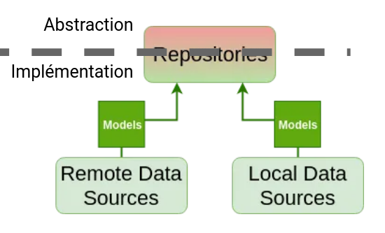

# Test-Driven Development et Clean Architecture

## Un exo pour suivre

Prenez le template qu'on utilisera pour la formation :

```sh
git clone git@github.com:Darkness4/flutter-architecture-template.git
```

On cherchera à afficher les propriétés d'un utilisateur de Gitlab en particulier. Il faudra donc faire une requête HTTP GET à Gitlab.

Documentation : https://docs.gitlab.com/ee/api/users.html

Exemple avec [curl](https://curl.haxx.se/) (à taper dans le terminal) :

```sh
curl "https://gitlab.com/api/v4/users?username=Darkness4"
```

Exemple en dart : 

```dart
import 'package:http/http.dart' as http;

Future<void> printUser(String username) async {
  http.Response response = await http.get('https://gitlab.com/api/v4/users?username=$username');
  print(response.body);
}

Future<void> main() async {
  printUser("Darkness4");
}
```

## Rappel sur un paradigme : Programmation Orientée Objet

La POO est basée sur **4 piliers**.

### Encapsulation

Un objet possède des propriétés et des méthodes, et possède différent niveau de restrictions.

En C, la restriction était posé avec le `.h`. Les objets définit dans le `.c` sont `protected` et les objets dans le `.h` sont publiques. Le **problème** en C, c'est que lorsque d'une structure est dans le `.h`, **tout le contenu** devient publique.

Du coup, en C++, pour arranger ce problème, on utilise des `class` qui définisse des propriétés et des méthodes accessibles uniquement selon 3 niveaux :

- **private** : Seule la classe a accès
- **protected** : Seules la classe et les sous-classes ont accès
- **public** : Accessible par tout le monde

Le`.h` existe toujours en C++ et permet de définir des classes privées, protégées ou publiques. Dans Java, on doit rajouter toujours `public class` ou `private class` (protected est le fichier java en lui-même). Dans Dart, publique c'est `class NomDeLaClasse`, protected c'est `class _NomDeLaClasse` et private, c'est une seule protected class dans un fichier .dart.

**NOTE** : 

```dart
class Person {
  int _age;

  int get age => _age;
  void set age(int age) => _age = age;
}
```

Ceci ne rajoute AUCUNE sécurité en plus.

Cependant :

```dart
class Person {
  int _age;

  DateTime get birthday => calculateBirthday(_age);
  void set birthday(DateTime date) => DateTime.now().year - date.year;
}
```

Ou juste :

```dart
class Person {
  int _age;

  DateTime get birthday => calculateBirthday(_age);
}
```

Ou mieux :

```dart
abstract class LivingBeing {
  DateTime get birthday;
}

class Person extends LivingBeing {
  int _age;

  @override
  DateTime get birthday => calculateBirthday(_age);
}
```

Le getter/setter devient intéressant quand on veut :

- éviter un doublons d'une propriété ayant la même signification
- du read-only
- du polymorphisme

### Héritage

Il existe une nouvelle classe incluant les caractéristiques d'une autre classe.

C++ :

```cpp
class Forme {
 protected:
  std::string _name;
 public:
  Forme(std::string name) { _name = name; }
};
 
class Carre: public Forme {
 public:
  Carre(std::string name): Forme(name) {}
  void rename(std::string name) { _name = name; }
};
```

Dart :

```dart
class Forme {
  String _name;  // Protected in current file !

  Forme(String this._name);
}

class Carre extends Forme {
  Carre(String name): super(name);

  void rename(String name) => _name = name;
}
```

### Abstraction

Un méthode abstraite est une fonction n'ayant aucune implémentation.

Une classe abstraite est un objet n'ayant pas encore une implémentation. Une classe abstraite ne peut être instanciée tant qu'il existe une méthode abstraite (virtual pure).

C++ :

```cpp
// Classe abstraite
class Forme {
 public:
  // Méthode virtuelle pure
  virtual float aire() = 0;

  // Une classe de base d’une hiérarchie polymorphe
  // doit toujours (ou presque) avoir un destructeur virtuel
  virtual ~Forme() {}
};
 
class Carre: public Forme {
 public:
  float aire() override { return m_cote*m_cote; }
 private:
  float m_cote;
};
 
class Cercle: public Forme {
 public:
  float aire() override { return 3.1415926535*m_rayon*m_rayon; }
 private:
  float m_rayon;
};
```

Dart : 

```dart
abstract class Forme {
  double get Aire;
}

class Carre extends Forme {
  double _cote;

  @override
  double get aire => _cote;
}
```

Une classe abstraite n'ayant que des méthodes abstraites est appelée **interface**.

Une classe héritant et implémentant une interface de telle sorte à ce qu'il peut être instancié est appelée **implémentation**.

En C++, le respect de la définition ci-dessus indique une interface.

```cpp
class Interface
{
public:
    Interface(){}
    virtual ~Interface(){}
    virtual void method() = 0;
};
```

Java :

```java
interface Forme 
{ 
    int Aire(); 
} 

class Carre implements Forme {
    private float _cote;
    public int aire() { return _cote*_cote; }
}
```

En Dart, toute classe peut être implémentée :

```dart
abstract class Forme {
  double get Aire;
}

class Carre implements Forme {
  double _cote;

  @override
  double get aire => _cote;
}
```

### Polymorphisme

Le polymorphisme définit le pouvoir d’exécuter la même fonction malgré que la signature de l'objet est différente.

C++ :

```c++
class Forme {
 public:
  virtual float aire() = 0;
  virtual ~Forme() {}
};
 
class Carre: public Forme {
 public:
  Carre(float cote): Forme() { m_cote = core; }
  float aire() override { return m_cote*m_cote; }
 private:
  float m_cote;
};
 
class Cercle: public Forme {
 public:
  Cercle(float rayon): Forme() { m_rayon = rayon; }
  float aire() override { return 3.1415926535*m_rayon*m_rayon; }
 private:
  float m_rayon;
};

int main() {
  Forme *forme;
  Carre carre(3);
  Cercle cercle(3);

  forme = &carre;
  forme->aire();
  forme = &cercle;
  forme->aire();
}
```

Dart :

```dart
abstract class Forme {
  double get aire;
}

class Carre extends Forme {
  double _cote;

  Carre(this._cote);

  @override
  double get aire => _cote;
}

class Cercle extends Forme {
  double _rayon;

  Cercle(this._rayon);

  @override
  double get aire => 3.1415926535*_rayon*_rayon;
}

void main() {
  Forme forme;
  Cercle cercle = Cercle(3);
  Carre carre = Carre(3);

  forme = carre;
  print(forme.aire);
  forme = cercle;
  print(forme.aire);
} 
```

Avec le polymorphisme, il est possible de faire une **inversion de dépendances**, c'est-à-dire, le flux de contrôle est inversée par rapport aux dépendances.


Sans inversion de dépendance :

```dart
// This is medium level.
class MediumLevel {
  void do() {}
}

// This is high level.
class HighLevel {
  final MediumLevel mediumLevel;

  HighLevel(this.mediumLevel);

  void doMl() => mediumLevel.do();
}

// Usage
void main {
  MediumLevel ml = MediumLevel();
  HighLevel(ml).doMl();
}
```

Avec inversion de dépendances :

```dart
// This is high level.
abstract class MediumLevel {
  void do();
}

class HighLevel {
  final MediumLevel mediumLevel;

  HighLevel(this.mediumLevel);

  void doMl() => mediumLevel.do();
}

// This is medium level. The dependency flow has inverted.
class MediumLevelImpl implements MediumLevel {
  @override
  void do() {}
}

// Usage
void main {
  MediumLevelImpl ml = MediumLevelImpl();
  HighLevel(ml);
}
```

Cela permet de découpler chaque classe et faciliter les tests unitaires en injectant des maquettes d'implémentations (e.g. `MockMediumLevel`).

### Conclusion

La programmation orientée objet permet un contrôle sur le flux de dépendance sur tout le code. Clean Architecture va pouvoir permettre de créer des couches d'abstraction afin que le flux de dépendances reste le même sur tout le code.

## Les 5 principes S.O.L.I.D.

Clean Architecture se base sur ces 5 principes qui permet de créer une base de code stable.

### Single Responsibility Principle

**“A module or a class should be responsible to one, and only one, actor”**

**“A module should have one, and only one, reason to change”**- Martin, Robert C. (2003). Agile Software Development, Principles, Patterns, and Practices

En gros, un objet ne doit pas changer à cause de plusieurs acteurs.


```dart
// Mauvais
class Employee {
  double workingHours;
  double salary;

  double calculatePay();  // Pour CFO
  void reportHour();  // Pour COO
  void save();  // Pour CTO
}
```

Ici, `Employee` peut changer (en terme de code source) à cause de plusieurs raisons. Rxemple : le CFO, COO et CTO peut faire changer l'objet selon leur usecase : `calculatePay` peut devenir `calculatePayInDollar` et va changer `salary` selon sont usecase.

Un autre exemple serait que le CFO utilise maintenant `reportHour` et le trafique sans que le COO le sache.

Cela arrive très couramment quand le code est partagé.

C'est pourquoi la seule et unique raison de changer une classe serait **l'ajout ou la déprécation d'une fonctionnalité**. 

Pour respecter le SRP, il faut donc une classe par responsabilité :


```dart
class PayCalculator {
  void calculatePay(Employee employee);
}
```

Les changements attribués à PayCalculator devrait **éviter de provoquer des effets secondaires.**

### Open-Closed Principle

Une classe est ouverte à l'extension et fermé à la modification.

Ceci rentre parfaitement dans la définition d'une classe abstraite.

```dart
abstract class Forme {
  // Fermé à la modification
  double get aire;
}

class Carre extends Forme {
  double _cote;

  Carre(this._cote);

  // Ouverte à l'extension
  @override
  double get aire => _cote;
}

class Cercle extends Forme {
  double _rayon;

  Cercle(this._rayon);

  // Ouverte à l'extension
  @override
  double get aire => 3.1415926535*_rayon*_rayon;
}

void main() {
  Forme forme;
  Cercle cercle = Cercle(3);
  Carre carre = Carre(3);

  forme = carre;
  print(forme.aire);
  forme = cercle;
  print(forme.aire);
} 
```

Si la classe n'était pas fermé à la modification (c.-à-d. `aire` devient `newAire`), le polymorphisme ne fonctionnerais plus.

### Liskov Substitution Principle

Si un objet o1 de type S, un sous-type de T.

Alors, pour tout programme P utilisant T, o1 peut être remplacé par o2 de type S **sans pour autant changer le comportement de P**.


C'est similaire au polymorphisme, sauf que l'on **prend en compte le comportement du programme**.

Une violation serait de ce type :


Ici, RubberDuck hérite de Duck. Cependant, il modifie le comportement de P en faisant crasher le programme P (`UnexpectedBehaviorException`) quand RubberDuck n'a pas de batterie. Ceci est une claire violation du LSP.

### Interface Segregation Principle

Aucun client ne devrait dépendre sur des fonctions qu'ils n'utilisent pas.


Solution :


(U1Ops serait l'équivalent du téléphone, U2Ops = talkie-walkie, U3Ops = sirène)

On évite de se coller des fonctions qui n'ont aucun rapport par rapport à l'utilisateur.

### Dependency Inversion Principle

- Les modules de haut niveau ne doivent pas dépendre des modules de bas niveau. Les deux devraient dépendre d'abstractions.
- Les abstractions ne doivent pas dépendre de détails. Les détails (implémentations concrètes) doivent dépendre des abstractions.


Si on observe bien, les flèches contrôle de flux sont inversé par rapport au dépendances (ServiceImpl dépend de Service, mais Service contrôle ServiceImpl).

Haut-niveau :

```dart
class App {
  final Service service;

  App(this.service);

  void useService() => service.use();
}

abstract class Service {
  void use();
}

// Injecteur de dépendances. Permet d'utiliser des singletons.
abstract class ServiceFactory {
  Service makeSvc();
}
```

Bas-niveau :

```dart
class ServiceImpl implements Service {
  @override
  void use() {}
}

class ServiceFactoryImpl implements ServiceFactory {
  static final Service _singletonService = ServiceImpl();

  @override
  Service makeSvc() => _singletonService;
}
```

```dart
void main() {
  ServiceFactory serviceFactory = ServiceFactoryImpl();  // Only once
  Service service = ServiceFactoryImpl.makeSvc();
  App app = App(service);
  app.useService();
}
```

A la place d'un service factory, on utilisera un container de dépendances qui fera de l'injection de dépendances.

## Clean Architecture par Uncle Bob (Robert C. Martin)

### En gros


**The Dependency Rule**

Circles = areas of software.

Further in you go, the higher level the software becomes. 

outer = mechanisms. inner = policies.

*Source code dependencies* can only point *inwards*.

Everything in an inner circle cannot know at all about something in an outer circle.

**Entities**

Entities encapsulate *Enterprise wide* business rules.

An entity can be an object with methods, or it can be a set of data structures and functions. 

**Use Cases**

These use cases orchestrate the flow of data to and from the entities, and direct those entities to use their *enterprise wide* business rules to achieve the goals of the use case.

X changes in this layer to affect the entities. X expect this layer to be affected by changes to externalities such as the DB, the UI, or any of the common frameworks.

This layer is isolated from such concerns.

Expect that changes to the operation of the application *will* affect the use-cases. If the details of a use-case change, then some code in this layer will certainly be affected.

**Interface Adapters**

Convert data from the format most convenient for the use cases and entities, to the format most convenient for some external agency such as the DB or the Web. 

**Frameworks and Drivers.**

The outermost layer is generally composed of frameworks and tools such as the DB, the Web Framework, etc.

Generally you don’t write much code in this layer other than glue code that communicates to the next circle inwards.

### Clean Architecture for Flutter


A chaque fois, que le flux de contrôle est inversée par rapport au dépendance, il faudra rajouter une couche d'abstraction. On compte 2 endroits où le flux est inversé : DataSource et Repositories.

## Clean Architecture par Matej Rešetár

### Couche Data

#### Data Sources

##### Rôle



Dans Clean Architecture, les data sources permettent de **récupérer des données** des stockages persistants.

Elles sont responsables des appels API tel que CRUD et le management du stockage local.

##### Type de data source

Une data source peut être locale ou remote.

Les solutions locales sur téléphone Android sont généralement :

- une base de données local ([SQLite](https://www.sqlite.org/index.html), [Hive](https://github.com/hivedb/hive), ...)
- [SharedPreferences](https://developer.android.com/reference/android/content/SharedPreferences)
- [KeyStore](https://developer.android.com/training/articles/keystore)
- Un fichier local

Les solutions remote sur téléphone Android sont généralement :

- Un API
- Un SDK (cloud firestore)

On rappelle qu'un API (Application Programming Interface) est une interface ou un protocole qui permet le lien entre un serveur et un client.

Exemple d'API : 

- RESTful API (le plus connu)
- GraphQL
- Falcor API
- gRPC API
- Pure JSON API (do it yourself)

Le protocole d'un API pour DB est généralement **HTTP**.

Une base de données suit généralement les 4 fonctions basiques CRUD : Create, Read, Update, Delete.

Voici les méthode HTTP généralement utilisé :

|       HTTP METHODS        | Member resource, such as `https://api.example.com/collection/item3` |
| :-----------------------: | :----------------------------------------------------------: |
|      GET<br />(Read)      | *Retrieve* representation of the member resource in the response body. |
|    POST<br />(Create)     | *Create* a member resource in the member resource using the instructions in the request body. The URI of the created member resource is *automatically assigned* and returned in the response *Location* header field. |
| PUT<br />(Update/Replace) | *Replace* all the representations of the member resource or *create* the member resource if it does not exist, with the representation in the request body. |
|    PATCH<br />(Update)    | *Update* all the representations of the member resource, or *may create* the member resource if it does not exist, using the instructions in the request body. |
|   DELETE<br />(Deletec)   |   *Delete* all the representations of the member resource.   |

|      Operation       |                         SQL                          |                             HTTP                             | [RESTful WS](https://en.wikipedia.org/wiki/Representational_state_transfer#Applied_to_Web_services) |     DDS     |
| :------------------: | :--------------------------------------------------: | :----------------------------------------------------------: | :----------------------------------------------------------: | :---------: |
|      **C**reate      | [INSERT](https://en.wikipedia.org/wiki/Insert_(SQL)) | [PUT](https://en.wikipedia.org/wiki/PUT_(HTTP)) / [POST](https://en.wikipedia.org/wiki/POST_(HTTP)) |      [POST](https://en.wikipedia.org/wiki/POST_(HTTP))       |    write    |
| **R**ead (Retrieve)  | [SELECT](https://en.wikipedia.org/wiki/Select_(SQL)) |       [GET](https://en.wikipedia.org/wiki/GET_(HTTP))        |       [GET](https://en.wikipedia.org/wiki/GET_(HTTP))        | read / take |
| **U**pdate (Modify)  | [UPDATE](https://en.wikipedia.org/wiki/Update_(SQL)) | [PUT](https://en.wikipedia.org/wiki/PUT_(HTTP)) / [POST](https://en.wikipedia.org/wiki/POST_(HTTP)) / [PATCH](https://en.wikipedia.org/wiki/PATCH_(HTTP)) |       [PUT](https://en.wikipedia.org/wiki/PUT_(HTTP))        |    write    |
| **D**elete (Destroy) | [DELETE](https://en.wikipedia.org/wiki/Delete_(SQL)) |    [DELETE](https://en.wikipedia.org/wiki/DELETE_(HTTP))     |    [DELETE](https://en.wikipedia.org/wiki/DELETE_(HTTP))     |   dispose   |

##### Code

En suivant le template données en début du document, le template doit afficher les données d'un utilisateur Github.

###### Remote

```dart
abstract class GithubRemoteDataSource {
  Future<GithubUserModel> fetchUser(String username);
}

class GithubRemoteDataSourceImpl implements GithubRemoteDataSource {
  final http.Client client;

  GithubRemoteDataSourceImpl({@required this.client});

  @override
  Future<GithubUserModel> fetchUser(String username) async {
    final response = await client.get('https://api.github.com/users/$username');

    if (response.statusCode == 200) {
      return GithubUserModel.fromJson(  // Parse
          json.decode(response.body) as Map<String, dynamic>);
    } else {
      throw ServerException('Failed to load User : ${response.statusCode}');
    }
  }
}
```

###### Local

```dart
abstract class GithubLocalDataSource {
  Future<void> cacheUser(GithubUserModel userToCache, String username);

  Future<GithubUserModel> fetchCachedUser(String username);
}

class GithubLocalDataSourceImpl implements GithubLocalDataSource {
  final Box<dynamic> box;  // This is a Hive Local DB

  GithubLocalDataSourceImpl({@required this.box});

  @override
  Future<void> cacheUser(GithubUserModel userToCache, String username) {
    return box.put(  // Create or Replace {key: value}
      username,
      json.encode(userToCache.toJson()),
    );
  }

  @override
  Future<GithubUserModel> fetchCachedUser(String username) async {
    final jsonString = box.get(username) as String;  // Read
    if (jsonString != null) {
      return GithubUserModel.fromJson(  // Parse
          json.decode(jsonString) as Map<String, dynamic>);
    } else {
      throw CacheException();
    }
  }
}
```

##### Tests unitaires

###### Remote

```dart
class MockHttpClient extends Mock implements http.Client {}

void main() {
  GithubRemoteDataSourceImpl dataSource;
  MockHttpClient mockHttpClient;
  const String tRepo = 'Darkness4/minitel-app';
  const String tUser = 'Darkness4';

  setUp(() {
    mockHttpClient = MockHttpClient();
    dataSource = GithubRemoteDataSourceImpl(client: mockHttpClient);
  });

  void setUpMockHttpClientSuccess200() {
    when(mockHttpClient.get(
      argThat(startsWith('https://api.github.com/users/')),
    )).thenAnswer((_) async => http.Response(fixture('user.json'), 200));
  }

  void setUpMockHttpClientFailure404() {
    when(mockHttpClient.get(any))
        .thenAnswer((_) async => http.Response('Something went wrong', 404));
  }

  group('fetchUser', () {
    final tGithubUserModel = GithubUserModel.fromJson(
        json.decode(fixture('user.json')) as Map<String, dynamic>);

    test(
      "should perform a GET request on a URL with tUser being the endpoint",
      () async {
        // arrange
        setUpMockHttpClientSuccess200();
        // act
        await dataSource.fetchUser(tUser);
        // assert
        verify(mockHttpClient.get(
          'https://api.github.com/users/$tUser',
        ));
      },
    );

    test(
      'should return GithubUserModel when the response code is 200 (success)',
      () async {
        // arrange
        setUpMockHttpClientSuccess200();
        // act
        final result = await dataSource.fetchUser(tUser);
        // assert
        expect(result, equals(tGithubUserModel));
      },
    );

    test(
      'should throw a ServerException when the response code is 404 or other',
      () async {
        // arrange
        setUpMockHttpClientFailure404();
        // act
        final call = dataSource.fetchUser;
        // assert
        expect(
            () => call(tUser), throwsA(const TypeMatcher<ServerException>()));
      },
    );
  });


```


###### Local

```dart
class _MockBox extends Mock implements Box<dynamic> {}

void main() {
  GithubLocalDataSourceImpl dataSource;
  MockBox mockBox;
  const String tRepo = 'Darkness4/minitel-app';
  const String tUsername = 'Darkness4';

  setUp(() {
    mockBox = MockBox();
    dataSource = GithubLocalDataSourceImpl(
      box: mockBox,
    );
  });

  group('fetchCachedUser', () {
    final tGithubUserModel = GithubUserModel.fromJson(
        json.decode(fixture('user.json')) as Map<String, dynamic>);
    test(
      'should return GithubUserModel from SharedPreferences when there is one in the cache',
      () async {
        // arrange
        when<dynamic>(mockBox.get(any)).thenReturn(fixture('user.json'));
        // act
        final result = await dataSource.fetchCachedUser(tUsername);
        // assert
        verify<dynamic>(mockBox.get(tUsername));
        expect(result, equals(tGithubUserModel));
      },
    );

    test(
      'should throw a CacheExeption when there is not a cached value',
      () async {
        // arrange
        when<dynamic>(mockBox.get(any)).thenReturn(null);
        // act
        final call = dataSource.fetchCachedUser;
        // assert
        expect(() => call(tRepo), throwsA(const TypeMatcher<CacheException>()));
      },
    );
  });

  group('cacheUser', () {
    final tGithubUserModel = GithubUserModel.fromJson(
        json.decode(fixture('user.json')) as Map<String, dynamic>);

    test(
      'should call SharedPreferences to cache the data',
      () async {
        // act
        await dataSource.cacheUser(tGithubUserModel, tUsername);
        // assert
        final expectedJsonString = json.encode(tGithubUserModel.toJson());
        verify(mockBox.put(
          tUsername,
          expectedJsonString,
        ));
      },
    );
  });
}
```


#### Models

##### Rôle


Les models sont les objets dans la couche Data. Elles permettent de décoder et convertir les données récupérées d'une Data Source (`fromJson`).

Elles peuvent également exporter leur données sous le format de l'API (`toJson`).

Si une data source est inexistante, un model ne devrait pas exister.

Un model est une extension d'un entity (c'est-à-dire qu'elle possède les même données).

**Un model doit donc assurer le transfert aisé vers une Data Source ou vice-versa.**

##### Code

On utilise, ici, `JsonSerializable` pour pouvoir générer automatique toJson et fromJson.

On utilise également `Equatable` qui permet de comparer différentes classes en terme de données et non en terme de HashCode (signature de l'instance).

```dart
part 'user_model.g.dart';

@JsonSerializable(explicitToJson: true)
class GithubUserModel extends Equatable {
  // Propriétés
  final String login;
  final int id;
  // [...]
  final DateTime updated_at;

  // Constructeur immutable
  const GithubUserModel({
    this.login,
    this.id,
    // [...]
    this.updated_at,
  });

  @override
  List<Object> get props => <Object>[
        login,
        id,
        // [...]
        updated_at,
      ];

  // Méthode de conversion : export
  Map<String, dynamic> toJson() => _$GithubUserModelToJson(this);

  // Méthode de conversion : import
  factory GithubUserModel.fromJson(Map<String, dynamic> json) =>
      _$GithubUserModelFromJson(json);
}
```

**Code généré :**

```dart
// GENERATED CODE - DO NOT MODIFY BY HAND

part of 'user_model.dart';

// **************************************************************************
// JsonSerializableGenerator
// **************************************************************************

GithubUserModel _$GithubUserModelFromJson(Map<String, dynamic> json) {
  return GithubUserModel(
    login: json['login'] as String,
    id: json['id'] as int,
    // [...]
    updated_at: json['updated_at'] == null
        ? null
        : DateTime.parse(json['updated_at'] as String),
  );
}

Map<String, dynamic> _$GithubUserModelToJson(GithubUserModel instance) =>
    <String, dynamic>{
      'login': instance.login,
      'id': instance.id,
      // [...]
      'updated_at': instance.updated_at?.toIso8601String(),
    };
```

#### Repositories Implementations

##### Rôle


L'utilisation de repositories est aussi connu sous le nom de Repository Pattern. 

Il faut savoir qu'il avant tout faire la couche l'abstraction **en premier** qui est dans la couche **Domain**.

Un repository doit contenir les méthode CRUD (ou plus) dédié à une **unique entity/business object**. Le repository de la couche Data **doit** implémenter un repository de la couche **Domain**.

Dans l'implémentation, il s'agira de **trier** entre Local et Remote Data Source.

##### Code

```dart
class UserRepositoryImpl implements UserRepository {
  final GithubLocalDataSource localDataSource;
  final GithubRemoteDataSource remoteDataSource;
  final NetworkInfo networkInfo;
  final GithubUserMapper mapper;

  const UserRepositoryImpl({
    @required this.remoteDataSource,
    @required this.localDataSource,
    @required this.networkInfo,
    @required this.mapper,
  });

  @override
  Future<GithubUser> getUser(String username) => _getUser(username);

  Future<GithubUser> _getUser(String username) async {
    if (await networkInfo.result != ConnectivityResult.none) {
      remoteDataSource.fetchUser(username).then(mapper.mapTo);
      final user = await remoteDataSource.fetchUser(username);
      await localDataSource.cacheUser(user, username);
      return mapper.mapTo(user);
    } else {
      final user = await localDataSource.fetchCachedUser(username);
      return mapper.mapTo(user);
    }
  }
}

```

##### Tests unitaires

```dart
class MockRemoteDataSource extends Mock implements GithubRemoteDataSource {}

class MockGithubUserMapper extends Mock implements GithubUserMapper {}

class MockLocalDataSource extends Mock implements GithubLocalDataSource {}

class MockNetworkInfo extends Mock implements NetworkInfo {}

void main() {
  UserRepositoryImpl repository;
  MockRemoteDataSource mockRemoteDataSource;
  MockGithubUserMapper mockGithubUserMapper;
  MockNetworkInfo mockNetworkInfo;
  MockLocalDataSource mockLocalDataSource;

  setUp(() {
    mockRemoteDataSource = MockRemoteDataSource();
    mockGithubUserMapper = MockGithubUserMapper();
    mockLocalDataSource = MockLocalDataSource();
    mockNetworkInfo = MockNetworkInfo();
    repository = UserRepositoryImpl(
      remoteDataSource: mockRemoteDataSource,
      localDataSource: mockLocalDataSource,
      networkInfo: mockNetworkInfo,
      mapper: mockGithubUserMapper,
    );
  });

  void runTestsOnline(Function body) {
    group('device is online', () {
      setUp(() {
        when(mockNetworkInfo.result)
            .thenAnswer((_) async => ConnectivityResult.wifi);
      });

      body();
    });
  }

  void runTestsOffline(Function body) {
    group('device is offline', () {
      setUp(() {
        when(mockNetworkInfo.result)
            .thenAnswer((_) async => ConnectivityResult.none);
      });

      body();
    });
  }

  group('getUser', () {
    const tUser = 'Darkness4';
    final DateTime tDateTime = DateTime.parse("1970-01-01T00:00:00Z");
    final tGithubUserModel = GithubUserModel.fromJson(
        json.decode(fixture('user.json')) as Map<String, dynamic>);
    final tGithubUser = GithubUser(
      login: 'login',
      id: 0,
      // [...]
      updated_at: tDateTime,
    );

    test(
      'should check if the device is online',
      () async {
        // arrange
        when(mockNetworkInfo.result)
            .thenAnswer((_) async => ConnectivityResult.wifi);
        when(mockRemoteDataSource.fetchUser(any)).thenAnswer((_) async => null);
        when(mockGithubUserMapper.mapTo(any)).thenReturn(null);
        // act
        await repository.getUser(tUser);
        // assert
        verify(mockNetworkInfo.result);
      },
    );

    runTestsOnline(() {
      test(
        'should return remote data when the call to remote data source is successful',
        () async {
          // arrange
          when(mockRemoteDataSource.fetchUser(any))
              .thenAnswer((_) async => tGithubUserModel);
          when(mockGithubUserMapper.mapTo(tGithubUserModel))
              .thenReturn(tGithubUser);
          // act
          final result = await repository.getUser(tUser);
          // assert
          verify(mockRemoteDataSource.fetchUser(tUser));
          expect(result, equals(tGithubUser));
        },
      );

      test(
        'should cache the data locally when the call to remote data source is successful',
        () async {
          // arrange
          when(mockRemoteDataSource.fetchUser(any))
              .thenAnswer((_) async => tGithubUserModel);
          // act
          await repository.getUser(tUser);
          // assert
          verify(mockRemoteDataSource.fetchUser(tUser));
          verify(mockLocalDataSource.cacheUser(tGithubUserModel, tUser));
        },
      );

      test(
        'should return server failure when the call to remote data source is unsuccessful',
        () async {
          // arrange
          when(mockRemoteDataSource.fetchUser(any))
              .thenThrow(ServerException());
          // act
          final call = repository.getUser;
          try {
            await call(tUser);
            fail("exception not thrown");
          } catch (e) {
            expect(e, isInstanceOf<ServerException>());
          }
        },
      );
    });

    runTestsOffline(() {
      test(
        'should return last locally cached data when the cached data is present',
        () async {
          // arrange
          when(mockLocalDataSource.fetchCachedUser(tUser))
              .thenAnswer((_) async => tGithubUserModel);
          when(mockGithubUserMapper.mapTo(tGithubUserModel))
              .thenReturn(tGithubUser);
          // act
          final result = await repository.getUser(tUser);
          // assert
          verifyZeroInteractions(mockRemoteDataSource);
          verify(mockLocalDataSource.fetchCachedUser(tUser));
          expect(result, equals(tGithubUser));
        },
      );

      test(
        'should return CacheFailure when there is no cached data present',
        () async {
          // arrange
          when(mockLocalDataSource.fetchCachedUser(tUser))
              .thenThrow(CacheException());
          // act
          final call = repository.getUser;
          // assert
          try {
            await call(tUser);
            fail("exception not thrown");
          } catch (e) {
            expect(e, isInstanceOf<CacheException>());
          }
        },
      );
    });
  });
}
```

### Couche Domain


